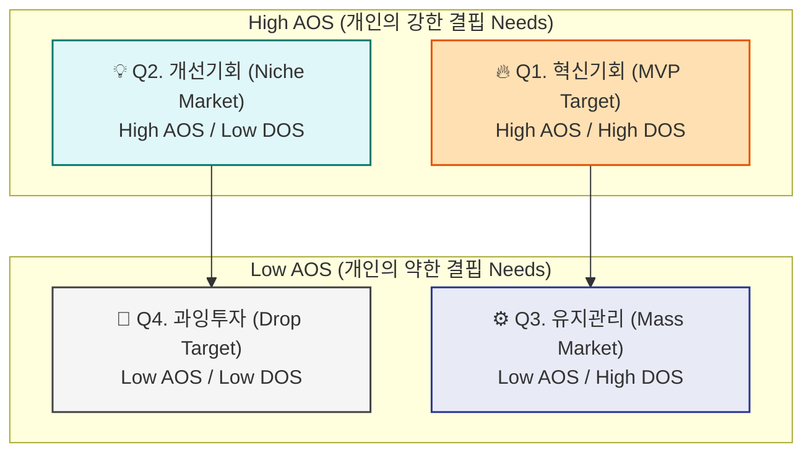
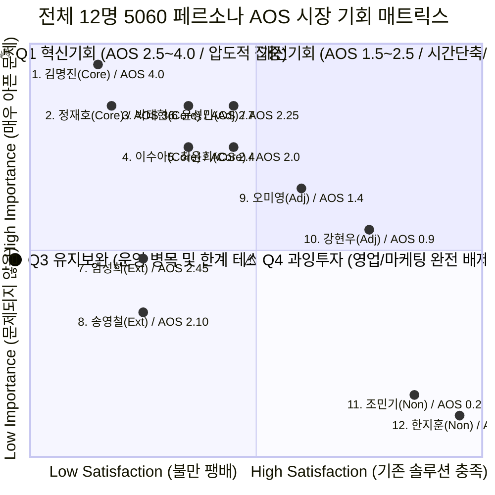

# 5060 프리미엄 매니지먼트: AOS-DOS 기회점수 통합 평가 및 매트릭스

고객 1명의 미충족 니즈(AOS)에 머물지 않고, 해당 문제가 가진 **시장 파급력(Market Relevance)**을 곱하여 실제 시장 진입 우선순위를 설정하는 **발견된 기회 점수(DOS, Discovered Opportunity Score)**를 산출했습니다.

이를 통해 “니즈는 높지만 시장이 작아 돈이 안 되는 영역”과 “진짜 돈이 몰려있는 MVP 우선 타깃”을 명확히 구분합니다.

---

## 🧑‍💻 1. 전체 12명 페르소나 기준 DOS(시장가중형 기회점수) 산출 결과

* **계산식:** `DOS = (Importance - Satisfaction) × Market Relevance`
* **Market Relevance (0.1 ~ 0.9):** 5060 시장 전체 모수 대비 해당 타깃의 비중(SOM 점유율), 지불 의향, 프리미엄 서비스 채택 난이도(성장성)를 종합하여 부여한 시장 가중 지수.

| 그룹 | 페르소나 (Pain/Unmet Need) | Imp | Sat | Mkt Rel(%) | **AOS** | **DOS** | Insight (기회 해석) |
| :---: | :--- | :---: | :---: | :---: | :---: | :---: | :--- |
| **Core** | **1. 김명진** (직함 대체용 B2B 제안서 변환 방법 부재) | 5.0 | 1.0 | **0.9** | 4.00 | **3.60** | 베이비부머 임원 퇴직 사이클 진입. 지불의향 및 모수 최대로 압도적 폭발력 예상 |
| **Core** | **2. 정재호** (아날로그 자산을 디지털로 설계해줄 파트너 부재) | 4.5 | 1.0 | **0.8** | 3.60 | **2.80** | 'Done-for-you'를 원하는 전통 관리직 모수의 거대함으로 높은 수익성 확보 가능 |
| **Core** | **3. 박태현** (딥테크 전문지식을 대중/B2B 언어로 번역 불가) | 4.5 | 2.0 | **0.7** | 2.70 | **1.75** | R&D/전문직들의 뚜렷한 병목이나 전체 시장 내 모수는 다소 낮으나 핏(Fit)은 확실함 |
| **Adj** | **6. 윤성민** (스타트업 오너/PR 강의안을 기획할 시간 부족) | 4.5 | 2.5 | **0.8** | 2.25 | **1.60** | 개인 사비가 아닌 '법인/마케팅 예산'을 활용하므로 높은 단가 수용 가능 및 리테이너 확장 용이 |
| **Core** | **4. 이수아** (경험을 기업 교육 패키지로 구조화할 역량 한계) | 4.0 | 2.0 | **0.8** | 2.40 | **1.60** | 가장 널리 분포된 HR/코칭/강연 예비 후보군으로 높은 시장 확산성을 지님 |
| **Ext** | **7. 임성희** (극단적 완벽주의로 인한 시각화/산출 병목) | 3.5 | 1.5 | **0.5** | 2.45 | **1.00** | 불만도(AOS)는 높으나, 1인 전문직의 좁은 입맛을 맞추는 채택 난이도가 높아 확장성 한계 |
| **Core** | **5. 최윤희** (자기 객관화 한계로 자기 브랜딩 포기/방치) | 4.0 | 2.5 | **0.6** | 2.00 | **0.90** | 실무자 출신이라 스스로 해결하려는 경향(대체재)이 있어 프리미엄 결제 전환비중이 상대적으로 낮음 |
| **Ext** | **8. 송영철** (체면 장벽으로 자신을 알리는 비즈니스 실행 제로) | 3.0 | 1.5 | **0.4** | 2.10 | **0.60** | 은퇴 모수는 많으나 거만한 체면을 극복시키는 전환(Onboarding) 비용이 지나치게 높음 |
| **Adj** | **9. 오미영** (하이엔드 B2B로 넘어갈 시그니처 무기 부재) | 3.5 | 3.0 | **0.6** | 1.40 | **0.30** | 기존 B2C 강사 시장의 툴은 많으나 프리미엄 결제로 진입하려는 실수요 전환 장벽 존재 |
| **Adj** | **10. 강현우** (퇴직 대비 관망형 1차 병목) | 3.0 | 3.5 | **0.7** | 0.90 | **-0.35** | 시장 파급력(조직 내 대기수요)은 매우 크나, 아직 시급하지 않아 지갑을 열지 않음 |
| **Non** | **11. 조민기** (지식을 B2B 자산으로 유통한다는 산업 자체 부정) | 1.0 | 4.0 | **0.1** | 0.20 | **-0.30** | 산업 방향성과 완전 엇나간 대상으로 타겟 외 시장 |
| **Non** | **12. 한지훈** (지식 수익화 무대 불필요, 단순 과시 원함) | 1.0 | 5.0 | **0.2** | 0.00 | **-0.80** | 비용 지불 능력은 풍부하나 솔루션 정합성이 0이므로 노이즈로 작용함 |

---

## 📈 2. AOS vs DOS 통합 기회 매트릭스 시각화

개인의 결핍(AOS)과 시장의 돈이 되는(DOS) 영역을 상호 맵핑하여 우선순위를 산출합니다.
(*기준점: AOS 2.0 이상 = High / DOS 1.2 이상 = High*)

### 🧩 12인 사분면 맵핑 표

| Quadrant | 페르소나 및 Pain | AOS | DOS | 전략 방향성 |
| :---: | :--- | :---: | :---: | :--- |
| **🔥 Q1** (High / High) | **김명진, 정재호, 박태현(Core)** **이수아(Core), 윤성민(Adj)** | 2.25~4.00| 1.6~3.6 | **[최우선 공략 / 타게팅 1순위]** 고객도 아프고 시장 모수도 압도적으로 큽니다. 우리의 모든 서비스, 랜딩페이지 워딩, 초기 마케팅 비용을 이 5인의 문제 해결(완벽 대행, 기업교육 제안서 등)에 100% 집중해야 합니다. |
| **💡 Q2** (High / Low) | **임성희(Ext), 송영철(Ext)** **최윤희(Core)** | 2.0~2.45 | 0.6~1.0 | **[전략적 수익/운영 개선 대상]** 본인들만의 니즈 결핍은 심각하지만 시장 확장성이 떨어지는 니치마켓(Niche Market)입니다. 맞춤 서비스보다는 철저한 '템플릿화' 및 '가격 차등을 통한 고가 방어 전략'으로 마이그레이션이 필요합니다. |
| **⚙️ Q3** (Low / High) | *현재 해당 페르소나 없음* (잠재적 강현우의 진화형) | - | - | 고객 결핍은 적으나 잠재 모수가 큰 Mass Market. 향후 MVP 안정화 후 AI 웹 자가진단 툴 같은 초저가/무료 배포용으로 활용할 잠재 영역입니다. |
| **🚫 Q4** (Low / Low) | **오미영(Adj), 강현우(Adj)** **조민기(Non), 한지훈(Non)** | 0.0~1.40 | -0.8~0.3 | **[철저한 영업 보류 및 배제]** 시장 확산 기대치도, 개인의 고통(결핍도)도 마이너스에 위치합니다. 이들에게 광고 예산을 소모하지 않도록 강력한 사전 필터링 장치 설정이 필수입니다. |

---

## 🎯 3. 최종 결론 (CEO/PM 브리핑)

1. **타게팅 집중 지점 (MVP의 유일한 고객)**
우리의 **[프리미엄 1:1 매니지먼트 패키지 (Option B)]**를 무조건 팔아야 하는 대상은 철저하게 **AOS 강도 3.0, DOS 마력비 2.0 이상을 돌파하는 "전환기 대기업 임원/본부장 출신(김명진, 정재호)"**입니다. 이들은 B2B 세일즈 제안서 작성을 극도로 버거워하며 비용을 감수하고 아웃소싱하기를 원합니다. 

2. **확장 모델의 발견 (B2B 세일즈 레버리지)**
DOS 점수 산출 결과, 개인 자산화 영역뿐 아니라 **윤성민(스타트업 대표)**의 수요가 DOS 점수 1.6으로 고가치 Q1 영역에 진입했습니다. 즉, '은퇴 준비자'의 재취업/강연 포트폴리오만큼, 초기 법인의 영업 생존이 결린 '오너 브랜드 / 기술 키노트 대행' 시장 역시 놓치지 않아야 합니다.

3. **기회라고 착각하기 쉬운 덫 (Q2 판별)**
결핍(불가능, 강한 의존도 등)이 강해 기회처럼 보였던 임성희(완벽주의자), 송영철(체면장벽) 등은 **DOS(시장 파급력 및 확산성)를 곱하자 수익성 없는 Q2 니치 영역으로 급격하게 점수가 하락**했습니다. 이는 이들을 붙잡고 설득하는 것이 우리 기업의 스케일업(Scale-up)에 전혀 도움이 되지 않음을 시사합니다.

# 5060 프리미엄 매니지먼트: 전체 12명 페르소나 AOS 기회점수 평가 및 전략

제시된 **조정형 기회점수(AOS, Adjusted Opportunity Score)** 방법론을 적용하여, 앞서 정의된 **전체 12명의 페르소나**가 겪는 핵심 Pain을 기준으로 기회점수를 도출하고 사분면 매트릭스로 구조화한 분석 문서입니다.

---

## 📊 1. 전체 12명 페르소나 AOS 기회점수 산출 표

* **평가 기준:** Importance(중요도, 1~5점), Satisfaction(현재 대안 만족도, 1~5점)
* **AOS 계산식:** `Importance × (1 - Satisfaction / 5)`

| 그룹 | 페르소나 | 핵심 Pain / Unmet Need | Imp | Sat | 1-(Sat/5) | **AOS** | 해석 영역 |
| :---: | :--- | :--- | :---: | :---: | :---: | :---: | :--- |
| **Core** | 1. 김명진(전환대기 임원) | 직함을 대체할 B2B 세일즈 제안서 변환 방법 부재 | 5.0 | 1.0 | 0.8 | **4.00** | 🔥 Q1. 압도적 혁신기회 |
| **Core** | 2. 정재호(영업본부장) | 아날로그적 한계. 자기 자산을 디지털로 설계할 조력자 부재 | 4.5 | 1.0 | 0.8 | **3.60** | 🔥 Q1. 강력한 혁신기회 |
| **Core** | 3. 박태현(딥테크 연구소) | 방대한 테크 전문지식을 대중/비즈니스 언어로 번역 불가 | 4.5 | 2.0 | 0.6 | **2.70** | 🔥 Q1. 명확한 혁신기회 |
| **Core** | 4. 이수아(HR 총괄 상무) | 경험을 고단가 B2B 교육 패키지로 구조화하는 전문성 부족 | 4.0 | 2.0 | 0.6 | **2.40** | 💎 Q1-Q2. 부분적 혁신/개선 |
| **Core** | 5. 최윤희(경력 CMO) | 자기 객관화 한계로 인해 내 브랜드의 파편화 정리 불가 | 4.0 | 2.5 | 0.5 | **2.00** | 💎 Q2. 개선 기회 |
| **Adj** | 6. 윤성민(스타트업 대표) | 오너 권위 및 PR(강의안)을 기획할 물리적 시간의 극도 부족 | 4.5 | 2.5 | 0.5 | **2.25** | 💎 Q1-Q2. 강한 개선 기회 |
| **Ext** | 7. 임성희(완벽주의 세무사) | 디지털 툴 한계와 극단적 완벽주의로 인한 시각화/산출 병목 | 3.5 | 1.5 | 0.7 | **2.45** | ⚫ Q3. 유지/보완 집중군 |
| **Ext** | 8. 송영철(체면장벽 부사장) | 체면 때문에 비즈니스(자신을 앎림)를 시작하는 실행력 제로 | 3.0 | 1.5 | 0.7 | **2.10** | ⚫ Q3. 유지보완/테스트군 |
| **Adj** | 9. 오미영(정체된 강사) | B2C/저단가 늪을 탈출할 하이엔드 B2B 시그니처 자산 부재 | 3.5 | 3.0 | 0.4 | **1.40** | 💎 Q2. 점진적 개선 영역 |
| **Adj** | 10. 강현우(관망형 팀장) | 퇴직 대비 방향성은 없으나 당장 문제 해결의 시급성도 낮음 | 3.0 | 3.5 | 0.3 | **0.90** | ⚫ Q3. 잠재적 유지 영역 |
| **Non** | 11. 조민기(기능형 현장장) | 지식을 B2B 자산으로 유통한다는 개념(산업) 자체를 거부 | 1.0 | 4.0 | 0.2 | **0.20** | ⚠️ Q4. 과잉투자(필터링) |
| **Non** | 12. 한지훈(초과수익 VIP) | 지식을 통한 수익창출 무대 불필요. 명예직/PR로 완벽 충족 | 1.0 | 5.0 | 0.0 | **0.00** | ⚠️ Q4. 자원 낭비(배제) |

> 💡 **점수 도출 인사이트**
> 점수의 편차가 매우 드라마틱하게 나타납니다. 김명진, 정재호(AOS 3.6~4.0) 등은 생존과 수익 창출의 본원적 한계에 부딪혀 고통이 높으나 시장에 대안이 없어 **AOS 기회 점수가 폭발**합니다.
> 반면 뒤로 갈수록 임성희, 송영철은 고통 지수(불만족)는 높으나 우리 서비스의 본질과 직결되는 사업적 중요성(Importance)은 상대적으로 하락하고(운영 병목), Non-user 구역은 기대/니즈 자체가 증발해 기회점수가 0에 수렴합니다.

---

## 📈 2. 전체 12인 AOS 시각화 매트릭스 (Quadrant Chart)
중심선 기준: `Importance 3.0`, `Satisfaction 3.0`을 기준으로 4분할

---

## 🏁 3. 사분면(Quadrant) 및 기회 점수에 따른 "실전 시장 접근 전략"

### 1) 🔥 Q1 [AOS 2.7 ~ 4.0] : 파괴적 혁신 및 전면 투자 영역 (MVP 1순위)
* **포진 대상:** 1번 김명진, 2번 정재호, 3번 박태현 (Core 그룹 상위)
* **전략 방향:** 고객은 당장 죽겠는데(Imp 4.5 이상) 해소해 줄 서비스(Sat 1.0~2.0)가 아예 없습니다. 이들은 우리의 42문항 코칭과 1:1 VVIP 대행 논리를 가장 절실하게 환영할 집단입니다. 
* **MVP 적용:** 마케팅의 모든 워딩과 초기 진입 메시지(랜딩 페이지 카피 등)는 무조건 이 세 명의 Pain("당신의 숨겨진 무기를 B2B 언어로 100% 대행해 드립니다")에 꽂히도록 설계해야 합니다.

### 2) 💎 Q1~Q2 경계 [AOS 1.4 ~ 2.5] : 가치 제고 / 개선 기회 영역
* **포진 대상:** 4번 이수아, 5번 최윤희, 6번 윤성민, 9번 오미영
* **전략 방향:** 대안(일반 디자인 외주 대행, 자기계발 코칭 등)이 존재해 나름의 방식(Sat 2~3)으로 해결하려 하나, 비즈니스의 격을 높일 만큼 날카롭지 못해 Pain이 남아있습니다.
* **MVP 적용:** 무에서 유를 창조하는 '혁신'보다는 **'압도적 시간 단축', 'B2B/기업 특화 관점 최적화'**라는 비즈니스 **효율 개선 가치**를 강조하여 스케일업(Scale-up) 타깃으로 다룹니다.

### 3) ⚫ Q3 [AOS 0.9 ~ 2.5] : 유지 및 방어 영역 (기회인 척하는 블랙홀)
* **포진 대상:** 7번 임성희, 8번 송영철, 10번 강현우
* **전략 방향:** 불만은 높지만(Low Sat), 비즈니스 목표 달성 측면에서 결정적으로 중요하지 않은(Low Imp) 디테일(완벽주의, 체면 등)에 매몰된 그룹입니다. 
* **MVP 적용:** 이 사람들을 만족시키기 위해 추가 기능이나 인력을 배치하면 수익성(ROI)이 붕괴됩니다. 기대치를 조율할 수 있는 '수정 횟수 상한선'이나 '프레임워크 외 예외 없음' 등 강제적인 UX 방어막이나 사전 안내 템플릿 처리로 리소스를 차단해야 합니다. 

### 4) ⚠️ Q4 [AOS 0 근처] : 과잉 투자 및 배제 영역
* **포진 대상:** 11번 조민기, 12번 한지훈
* **전략 방향:** 우리 비즈니스 지형에 들어올 확률도, 체류할 당위성도 제로인 완벽한 허수 그룹입니다. 
* **MVP 적용:** 광고나 기획 단계에서 이런 성향의 사람들이 보일 경우 유입 필터링을 목적으로 강도 높은 사전 질문지, 금액 허들 등을 세팅해 과감하게 영업 에너지 소모를 차단해야 합니다.
