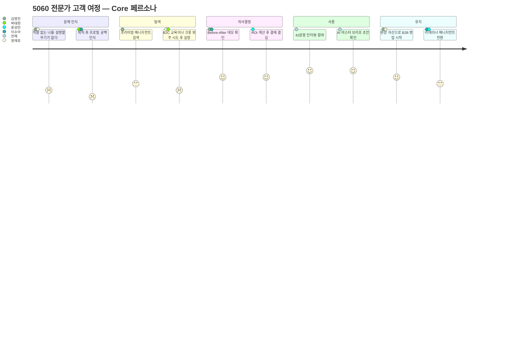
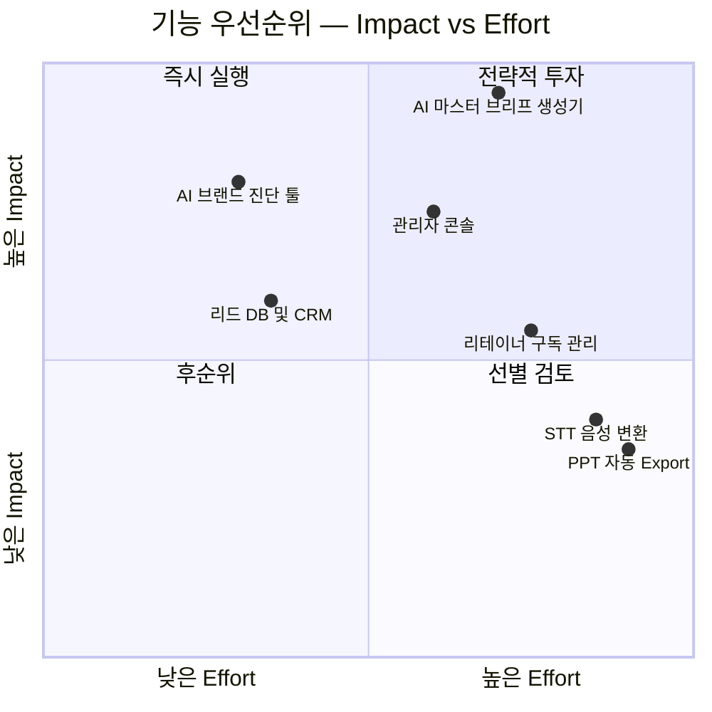
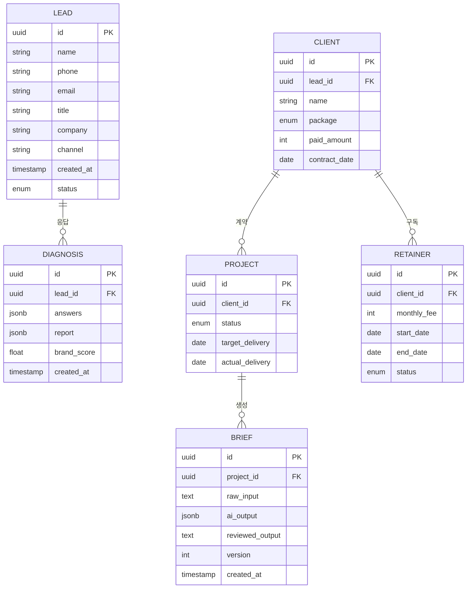
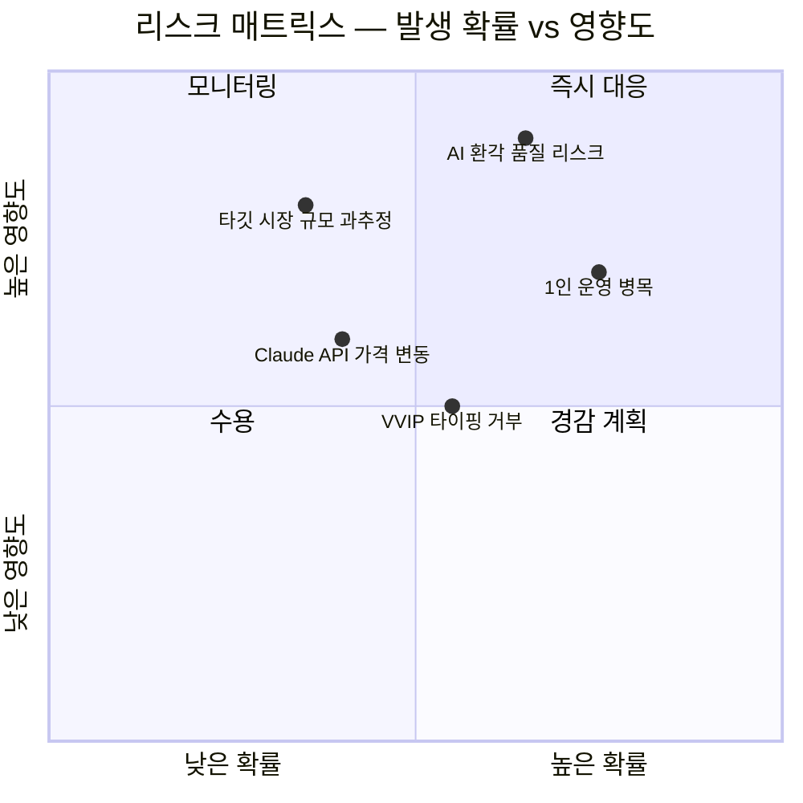
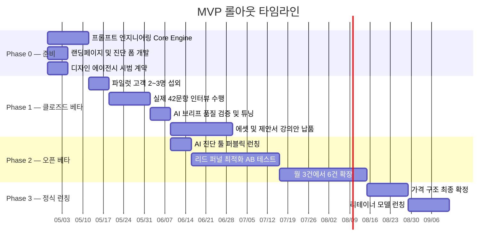

# 5060 프리미엄 브랜드 매니지먼트 PRD v0.2

| 항목 | 내용 |
| :--- | :--- |
| **Owner 팀** | 브랜드 매니지먼트 사업부 (대표 1인 + AI Ops) |
| **최종 업데이트** | 2026-04-21 |
| **문서 버전** | v0.2 — 품질 리뷰 반영본 (측정 가능성·검증 가능성 보강) |
| **이전 버전** | [v0.1 — 초안](./PRD_5060_Premium_Brand_Management_v0.1.md) |
| **변경 이력** | KPI 측정 경로 추가, Negative AC 7건 신설, NFR 보안 테스트·비용 자동 차단 룰, 리스크 트리거 임계치, 실험 Kill-criteria, Proof 실패 대체안 |
| **근거 문서** | [Value Proposition Sheet V2 (통합 완성본)](../04_VPS-final/Value%20Proposition%20Sheet_2026.md) / [품질 리뷰 보고서](./PRD_Quality_Review_v0.1.md) |
| **상태** | 🟢 Review Complete — Phase 0 착수 승인 대기 |

---

## 1. 개요·목표

### 1-1. 문제 정의 (Pain 지표 포함)

5060 고경력 전문가(퇴직·전환기 임원, 연구원, 전문직)는 풍부한 암묵지를 보유하고 있으나, 이를 시장이 구매 가능한 B2B 자산(제안서·강의안)으로 변환하지 못해 **수익 기회를 상실**하고 있다.

| # | Pain | 실패 KPI (현재 기준선) | 수치 근거 |
| :---: | :--- | :--- | :--- |
| P1 | **경력 언어화 실패** — 직함은 있으나 ROI 기반 가치 제안 문장이 없음 | B2B 제안서 완성률 ≤ **5%** (3개월 내 1건도 완성하지 못하는 비율 95%) | JTBD 인터뷰: *"석 달째 빈 화면만 켜놓고 한 줄도 못 썼어요."* |
| P2 | **자산 분산·신뢰 저하** — 프로필·제안서·SNS가 파편화 | B2B 플랫폼(탤런트뱅크 등) 프로필 조회수 **0건/월**, 컨택 전환율 **0%** | JTBD 인터뷰: *"플랫폼에 가입은 했는데 조회수가 0입니다."* |
| P3 | **실행 진입 장벽(체면·디지털 피로)** — PPT 등 디지털 도구 조작 거부 | 서비스 자체 진행 시도율 **< 10%**, 외주(크몽 등) 만족도 **2.0/5.0** | JTBD 인터뷰: *"크몽 외주 줘봤자 속 빈 강정. C레벨한테 낼 수가 없어요."* |
| P4 | **기존 대안의 구조적 한계** — 전직 지원·코칭·매칭 플랫폼 이탈 | 기존 서비스 이용 후 B2B 수주 성공률 **< 3%**, 재구매율 **< 15%** | 경쟁사 20+社 분석 결과 |

### 1-2. 목표 (Desired Outcome 수치화)

> **Product Vision:** 5060 전문가의 축적된 암묵지를, 42문항 인터뷰 → AI 마스터 브리프 → B2B 제안서/강의안 50장으로 100% 대행 변환하여, 고객이 인터뷰 구술만으로 즉시 강연·자문 수익을 창출할 수 있는 **Done-for-you 프리미엄 매니지먼트 시스템**을 구축한다.

### 1-3. 성공 지표 (북극성 KPI / 보조 KPI)

| 구분 | KPI | 기준선 (As-Is) | 목표값 (To-Be) | 측정 주기 | 측정 경로 |
| :---: | :--- | :--- | :--- | :--- | :--- |
| **⭐ 북극성** | **고객 1인당 B2B 수주 건수** (서비스 완료 후 3개월 내) | 0건 | **≥ 2건** (고문 자문 1건 + 특강 1건 이상) | 분기 | 고객 월말 자가 보고 설문(Typeform) + 탤런트뱅크/리멤버 프로필 조회수 스크린샷 수집. Supabase `projects.outcome_count` 적재. |
| 보조 1 | 마스터 브리프 초안 생성 소요시간 | 48시간 (수동) | **≤ 30분** (AI 자동) | 건별 | 관리자 콘솔 `briefs.created_at` 타임스탬프 차이 자동 산출. Vercel Functions 실행 로그 교차 검증. |
| 보조 2 | Option B(880만 원) 전환율 (진단 리드 → 결제) | N/A (신규) | **≥ 10%** | 월간 | 산출식: (월간 Option B 결제 건수 / 월간 진단 완료 리드 수) × 100. Supabase `clients` + `diagnoses` 조인 쿼리. |
| 보조 3 | 고객 만족도(NPS) | N/A | **≥ 70** | 프로젝트 종료 시 | 납품 완료 후 7일 내 Typeform NPS 설문 자동 발송. 산출식: (%추천자 − %비추천자). |
| 보조 4 | 리테이너(월정액) 전환율 | N/A | **≥ 30%** (Option B 완료 고객 기준) | 분기 | 산출식: (리테이너 전환 고객 / Option B 납품 완료 고객) × 100. Supabase `retainers` 집계. |
| 보조 5 | AI 진단 리포트 완독 → CTA 클릭율 | N/A | **≥ 10%** | 주간 | 산출식: (GA4 이벤트 `cta_click` / GA4 이벤트 `report_scroll_complete`) × 100. GA4 탐색 보고서 주간 추출. |
| 보조 6 | 월간 신규 진단 리드 수 | 0명 | **≥ 50명** | 월간 | Supabase `leads.created_at` 월별 COUNT. GA4 유입 채널별 소스 교차 분석. |

---

## 2. 사용자와 페르소나

### 2-1. 핵심 페르소나 요약

> **AOS-DOS 기회점수 사분면** 기반으로 Q1(High AOS / High DOS) 5인을 최우선 공략 타깃으로 설정한다.

| Tier | 페르소나 | 핵심 Pain | AOS | DOS | 서비스 핏 |
| :---: | :--- | :--- | :---: | :---: | :--- |
| **🔥 Core** | **김명진 (55)** 前 대기업 전략기획 임원 | 직함 대체용 B2B 제안서 변환 방법 부재 | 4.00 | 3.60 | 압도적 폭발력. 최우선 공략 |
| **🔥 Core** | **정재호 (59)** 1금융권 영업본부장 | 아날로그 자산 → 디지털 설계 파트너 부재 | 3.60 | 2.80 | Done-for-you 전통 관리직 |
| **🔥 Core** | **박태현 (58)** 국책연구소 수석연구원 | 딥테크 지식 → B2B 언어 번역 불가 | 2.70 | 1.75 | R&D/전문직 병목 해소 |
| **💎 Core** | **이수아 (52)** 외국계 HR 총괄 임원 | 경험 → 기업교육 패키지 구조화 한계 | 2.40 | 1.60 | HR/코칭/강연 확산성 |
| **💎 Adj** | **윤성민 (48)** B2B SaaS 스타트업 대표 | 오너 PR·강의안 기획 시간 절대 부족 | 2.25 | 1.60 | 법인 예산 활용 가능 |

### 2-2. 고객 여정 Pain·Needs 맵

---

## 3. 사용자 스토리와 수용 기준 (AC)

### Story 1: B2B 제안서 무기 확보 (김명진 — 전환기 임원)

> **As a** 퇴직 전환기의 前 대기업 임원 (김명진),
> **I want** 내 30년 전략기획 경험을 C-Level이 즉시 납득하고 수백만 원을 결제할 수 있는 B2B 제안서·강의안으로 100% 대행 제작받기를,
> **So that** 빈 노트북 화면 앞에서의 3개월간의 무력감을 탈출하고, 1주일 내에 탤런트뱅크·원티드긱스에서 고문 자문 의뢰를 수주할 수 있다.

| AC# | Given | When | Then | 측정 임계치 |
| :---: | :--- | :--- | :--- | :--- |
| AC1 | 고객이 42문항 인터뷰(60~90분)를 완료한 상태 | AI 마스터 브리프 생성 요청이 제출되면 | 15p 분량의 마스터 브리프 초안이 자동 생성된다 | 생성 소요시간 **≤ 30분**, AI 환각(Hallucination) 비율 **< 5%** (검수자 태깅 기준) |
| AC1-N | 고객이 42문항 중 **20문항 미만**만 응답한 상태 | AI 마스터 브리프 생성 요청이 제출되면 | 시스템이 **"응답 부족(최소 20문항 필요)"** 경고를 출력하고 생성을 차단한다 | 차단 정확도 **100%** (20문항 미만 입력 시 생성 절대 불가) |
| AC2 | 마스터 브리프 검수가 완료된 상태 | 에셋 12종 + B2B 제안서 + 강의안 50장 제작이 완료되면 | 고객이 즉시 B2B 플랫폼에 업로드할 수 있는 완성된 PDF 패키지를 수령한다 | 전체 납품 리드타임 **≤ 8주**, 고객 검수 1차 통과율 **≥ 80%** |
| AC2-N | 고객 검수에서 **주요 수정 3건 이상** 요청된 상태 | 수정 요청이 접수되면 | 2차 수정본이 **5영업일 내** 재납품되고, 수정 이력이 `briefs.version`에 기록된다 | 2차 수정 후 통과율 **≥ 95%**, 최대 수정 횟수 **≤ 3회** |
| AC3 | 고객이 완성 자산을 B2B 플랫폼에 게시한 상태 | 게시 후 3개월이 경과하면 | 고문 자문 또는 특강 의뢰가 최소 1건 이상 수주된다 | 수주율 **≥ 50%** (서비스 완료 고객 기준), 건당 수주 금액 **≥ 200만 원** |

### Story 2: 디지털 도구 노동 해방 (정재호 — 아날로그 영업본부장)

> **As a** 디지털 도구 조작에 극심한 스트레스를 느끼는 5060 아날로그 전문가 (정재호),
> **I want** 산책하며 핸드폰 녹음기로 말한 내용만 전달하면, 세련된 강의안·기업 제안서로 탈바꿈시켜주는 전속 기획 파트너를,
> **So that** PPT를 직접 만드는 초라함과 체면 손상 없이, 기업 무대에 즉각 진출할 수 있다.

| AC# | Given | When | Then | 측정 임계치 |
| :---: | :--- | :--- | :--- | :--- |
| AC1 | 고객이 음성 녹음(구술) 파일을 전달한 상태 | 운영자가 녹취 텍스트를 콘솔에 입력하면 | 구술 내용이 논리적 구조를 갖춘 B2B 제안 카피로 자동 변환된다 | 핵심 메시지 반영률 **≥ 90%** (고객 확인 기준), 변환 소요시간 **≤ 1시간** |
| AC1-N | 녹취 텍스트가 **500자 이하**이거나 핵심 키워드 추출 불가 상태 | 운영자가 콘솔에 입력하면 | 시스템이 **"입력 부족 — 최소 1,000자 이상 필요"** 경고를 출력하고 재입력을 요청한다 | 경고 출력 정확도 **100%**, 500자 이하 입력 시 AI 생성 차단 |
| AC2 | 전체 프로젝트 진행 중 | 고객의 디지털 도구 직접 조작이 요구되는 시점이 발생하지 않는다 | 고객 본인 개입률(타이핑·디자인·편집 등) **0%** 유지 | 고객 디지털 노동 시간 **= 0시간** (프로젝트 종료 체크리스트에서 고객 확인) |
| AC3 | 완성된 강의안/제안서 납품 시 | 고객이 산출물의 품격(格)을 평가하면 | C-Level 대상 프레젠테이션 적합성 점수가 기준 이상이다 | 고객 만족도 **≥ 4.5/5.0**, "체면 손상 없음" 응답 **≥ 95%** |

### Story 3: 리드 확보를 위한 AI 브랜드 진단 (잠재 고객 전체)

> **As a** B2B 시장 진출을 고민하는 5060 전문가,
> **I want** 5~10문항의 간단한 AI 진단을 통해 내 브랜드의 약점과 시장 진입 가능성을 객관적으로 확인하기를,
> **So that** 프리미엄 매니지먼트 서비스의 필요성을 체감하고 상담을 신청할 수 있다.

| AC# | Given | When | Then | 측정 임계치 |
| :---: | :--- | :--- | :--- | :--- |
| AC1 | 잠재 고객이 랜딩페이지에 접속한 상태 | 5문항 진단 폼을 완료하면 | AI 기반 "브랜드 지수·약점 분석 리포트"가 즉시 출력된다 | 리포트 생성 시간 **≤ 10초**, 폼 완료율 **≥ 60%** |
| AC1-N | 잠재 고객이 5문항 **모두 동일 선택지**를 고른 상태 | 진단 폼을 제출하면 | 시스템이 **"응답 패턴 이상 — 다시 한번 확인해주세요"** 메시지를 출력하고 리포트를 미생성한다 | 불성실 응답 필터 정확도 **≥ 95%**, 정상 응답 오차단율 **< 2%** |
| AC2 | 리포트가 출력된 상태 | 고객이 리포트를 완독하면 | VVIP 매니지먼트 상담 신청 CTA가 명확히 노출된다 | 리포트 완독률 **≥ 70%**, CTA 클릭율 **≥ 10%** |
| AC3 | CTA를 클릭한 상태 | 상담 신청 폼을 제출하면 | 리드 정보(이름·연락처·진단 결과)가 Supabase DB에 즉시 저장된다 | 데이터 저장 성공률 **≥ 99.5%**, 24시간 내 팔로업 연락 **100%** |
| AC3-N | 상담 신청 폼에 **이메일 형식 오류** 또는 **연락처 누락** 입력 | 제출 버튼을 클릭하면 | 해당 필드에 **즉시 인라인 에러 메시지**가 노출되고 제출이 차단된다 | 에러 메시지 출력 지연 **≤ 200ms**, 잘못된 데이터 DB 저장 **0건** |

### Story 4: 자기 객관화 및 핵심 무기 추출 (윤성민 — 시간 부족 대표)

> **As a** 본업에 바빠 자기 객관화에 시간을 할애할 수 없는 B2B 스타트업 대표 (윤성민),
> **I want** 42문항 구조화 인터뷰를 통해 내가 미처 인식하지 못한 핵심 강점과 시장 포지셔닝을 전문가가 추출해주기를,
> **So that** 오너 PR·강연 활동을 위한 시그니처 콘텐츠를 법인 비용으로 확보할 수 있다.

| AC# | Given | When | Then | 측정 임계치 |
| :---: | :--- | :--- | :--- | :--- |
| AC1 | 고객이 42문항 인터뷰에 참여한 상태 | 인터뷰 데이터가 AI 코어 엔진에 입력되면 | 가치선언문·핵심 타깃·강의 주제 3종이 자동 도출된다 | 고객의 "내 핵심을 정확히 짚었다" 동의율 **≥ 85%** |
| AC1-N | 인터뷰 데이터 입력 후 AI 도출 결과에 대해 **고객 동의율 < 50%** | 브리프 검수 미팅에서 고객이 거부하면 | 시스템이 **2차 보완 인터뷰(30분)** 스케줄을 자동 생성하고, 보완 질문 5문항을 사전 발송한다 | 2차 인터뷰 후 동의율 **≥ 80%**, 스케줄 생성 소요시간 **≤ 1영업일** |
| AC2 | 가치선언문이 도출된 상태 | 마스터 브리프로 확장되면 | 고객의 경력 내러티브가 일관된 B2B 메시지로 통합된다 | 메시지 일관성 점수 **≥ 4.0/5.0** (외부 전문가 블라인드 평가, 루브릭: 논리성·톤앤매너·타깃 적합도 3항 평균) |
| AC3 | 전체 에셋이 완성된 상태 | 고객이 법인 비용처리를 요청하면 | 세금계산서 발행이 즉시 가능하다 | 발행 소요시간 **≤ 1영업일**, 법인 결제 비율 **≥ 40%** |

---

## 4. 기능 요구사항 (Functional) — MoSCoW 우선순위

### 4-1. 우선순위 매트릭스

### 4-2. 기능 목록

| 우선순위 | 기능 | 설명 | 대안 대비 가치 근거 |
| :---: | :--- | :--- | :--- |
| **Must** | **F1. AI 마스터 브리프 생성기** (Core Engine) | 42문항 인터뷰 텍스트 → 15p 마스터 브리프 자동 생성. 168개 프롬프트 패턴 적용. | 기존 수작업(48시간) 대비 **96배 속도 향상**. 인건비 기준 건당 48만 원 → 5천 원(API 비용)으로 **비용 99% 절감**. |
| **Must** | **F2. AI 브랜드 진단 툴** (Lead Funnel) | 5~10문항 객관식 진단 → Claude API 분석 → 브랜드 지수·약점 리포트 즉시 출력 → CTA 연결. | 기존 전직 교육(제이엠커리어 등)의 **집단 매뉴얼 교육** 대비, 개인 맞춤형·즉시 피드백. 리드 확보 비용 **80% 절감** (광고 의존 탈피). |
| **Must** | **F3. 관리자 콘솔** (Back-Stage) | 인터뷰 Raw 텍스트 입력 → AI 변환 결과(가치선언문/타깃/강의안 목차/제안서 뼈대) 텍스트 일괄 반환 → 검수 UI. | 기존 기획자 의존 모델(코칭경영원 등) 대비, 운영자 1인이 **월 6건 이상** 병렬 처리 가능. |
| **Must** | **F4. 리드 DB (Supabase)** | 진단 응답자 정보(이름·연락처·진단 결과·유입 채널) 자동 적재 + 팔로업 트래킹. | 수동 엑셀 관리 대비 **데이터 누락 0%**, 리드 응답 속도 **24시간 → 실시간**. |
| **Should** | **F5. 고객 맞춤형 트래킹 대시보드** | 고객이 자산화 진척(브리프 완성 → 에셋 제작 → 제안서 완성) 현황을 실시간 조회. | KSF #5: 수강 기능 폐기 후 IT 자원을 진척 가시화에 집중. **벤치마크:** SaaS 온보딩 대시보드 도입 시 고객 만족도 +10~15p (Mixpanel 2024 Report). **목표:** 대시보드 사용 코호트 vs 미사용 코호트 A/B에서 NPS **+10p** 이상 검증. |
| **Should** | **F6. 리테이너 구독 관리** | 월정액(50~100만 원) 구독 결제·갱신·해지 관리 + 제안서 피보팅 이력 추적. | **LTV 산출 근거:** 기존 1회 880만 원 → 리테이너 전환 시 880만 원 + (월 75만 원 × 평균 유지 6개월) = **1,330만 원 (LTV 1.5배)**. 목표: Option B 완료 고객 리테이너 전환율 **≥ 30%**. |
| **Could** | **F7. STT(Speech-to-Text) 연동** | 고객 녹음 파일 → 자동 텍스트 변환 → AI 엔진 입력 자동화. | V2 이후. 현재는 운영자 수동 녹취로 대체. |
| **Won't (V1)** | **F8. PPT 디자인 자동 Export** | 브리프 텍스트 → 하이엔드 PPT 자동 생성. | V2 이후. 현재는 A급 디자인 에이전시 외주로 대체. |

---

## 5. 비기능 요구사항 (NFR)

### 5-1. 성능

| 항목 | 요구 수준 | 비고 |
| :--- | :--- | :--- |
| 진단 리포트 생성 응답 시간 (p95) | **≤ 15초** | Claude API 호출 포함 |
| 마스터 브리프 생성 응답 시간 (p95) | **≤ 10분** | 15p 분량, Streaming 출력 |
| 랜딩페이지 초기 로딩 (LCP) | **≤ 2.5초** | Vercel Edge CDN 활용 |
| API Rate Limit | **≥ 50 req/hr** per user | Claude API Tier 제약 내 |

### 5-2. 신뢰성

| 항목 | 요구 수준 |
| :--- | :--- |
| 월 가용성 (Uptime) | **≥ 99.0%** (Vercel Hobby 티어 기준, 월 다운타임 ≤ 7.3시간) |
| 오류율 (5xx) | **≤ 1.0%** |
| 데이터 백업 주기 | Supabase 자동 백업 **일 1회** |
| Claude API 장애 시 | Fallback 메시지 출력 + 수동 대응 프로세스 가동 (SLA: 4시간 내 수동 처리) |

### 5-3. 보안

| 항목 | 요구 수준 | 테스트 기준 |
| :--- | :--- | :--- |
| 고객 인터뷰 데이터 암호화 | AES-256 (저장 시), TLS 1.3 (전송 시) | 배포 전 SSL Labs 테스트 A+ 등급 확인 |
| 개인정보 보호 | 개인정보처리방침 게시, 최소 수집 원칙 (이름·연락처·직함·진단 결과) | 수집 항목 외 데이터 저장 여부 분기 1회 셀프 감사 |
| API Key 관리 | Vercel Environment Variables, 클라이언트 노출 **0%** | 배포 시 `git grep` 자동 스캔 — 하드코딩 키 **0건** 확인 |
| 접근 권한 | 관리자 콘솔 — 비밀번호 + IP 화이트리스트 | 미등록 IP 접속 시도 차단율 **100%**, 로그 즉시 알림 |
| 취약점 스캔 | 분기 1회 OWASP Top 10 셀프 스캔 (OWASP ZAP) | XSS·SQLi·CSRF 취약점 **0건** 기준. 발견 시 7일 내 패치 |

### 5-4. 비용

| 항목 | 월간 예상 비용 | 비고 | 상한 초과 대응 |
| :--- | :--- | :--- | :--- |
| Vercel Hobby | **$0** | 무료 티어 | — |
| Supabase Free | **$0** | 500MB DB, 1GB Storage | DB 80% 도달 시 Slack 알림 → 데이터 아카이빙 실행 |
| Claude API | **≤ $50/월** | 월 50건 진단 + 6건 브리프 기준 | **$100 도달 시 API 호출 자동 중단** + Slack 긴급 알림. 대표 수동 승인 후에만 재개. |
| 도메인 | **$12/년** | 연 1회 | — |
| **합계** | **≤ $50/월** (약 6.5만 원) | 1인 바이브코딩 MVP 기준 | 월 $100 하드캡 적용 |

### 5-5. 모니터링 항목

| 항목 | 도구 | 알림 기준 |
| :--- | :--- | :--- |
| 서버 오류 (5xx) | Vercel Analytics | 5분간 5xx ≥ 3건 → Slack 알림 |
| API 응답 시간 | Vercel Functions Log | p95 > 20초 → Slack 알림 |
| 리드 DB 적재 실패 | Supabase Webhooks | 실패 1건 발생 시 즉시 Slack 알림 |
| Claude API 비용 | Anthropic Dashboard | 일일 비용 > $5 → 이메일 알림. **월 $100 도달 → API 자동 중단** |
| 진단 폼 완료율 | Google Analytics 4 | 완료율 < 50% → 주간 리뷰 트리거 |
| **AI 환각율** | 관리자 콘솔 검수 태깅 | 검수 시 환각 문장 태깅 → **월간 환각율 > 10% 시 프롬프트 긴급 튜닝 Sprint 트리거** |
| **불성실 진단 비율** | Supabase 쿼리 (동일 응답 패턴) | **불성실 응답 > 20% 시 문항 재설계 검토** |

---

## 6. 데이터·인터페이스 개요

### 6-1. 핵심 엔터티 (ERD)

### 6-2. 주요 필드 설명

| 엔터티 | 핵심 필드 | 설명 |
| :--- | :--- | :--- |
| **LEAD** | `status` | `new` → `contacted` → `converted` → `lost` |
| **DIAGNOSIS** | `brand_score` | 0~100점 AI 산출 브랜드 지수 |
| **CLIENT** | `package` | `option_a` (650만 원) / `option_b` (880만 원) |
| **PROJECT** | `status` | `interview` → `brief` → `asset` → `review` → `delivered` |
| **BRIEF** | `version` | AI 생성 → 검수 수정 시 버전 증가 (이력 관리) |
| **RETAINER** | `status` | `active` / `paused` / `cancelled` |

### 6-3. 외부/내부 API 개요

| API | 방향 | 입력 | 출력 | 제약 |
| :--- | :---: | :--- | :--- | :--- |
| **Claude API** (Anthropic) | 외부 → 내부 | System Prompt + 인터뷰 텍스트 (max 200K tokens) | 마스터 브리프 JSON/Markdown | Rate: 50 req/min, Cost: ~$0.015/1K tokens |
| **Supabase REST API** | 내부 | CRUD (leads, diagnoses, clients, projects, briefs) | JSON | Row Level Security 적용, 500MB 제한 |
| **Vercel Serverless Functions** | 내부 | HTTP Request (POST /api/diagnose, POST /api/generate-brief) | JSON Response | 실행 시간 ≤ 60초 (Hobby), 메모리 1024MB |
| **Google Analytics 4** | 외부 | 페이지뷰·이벤트 태깅 | 대시보드·리포트 | GDPR 동의 배너 필요 |

---

## 7. 범위 (In/Out), 리스크·가정·의존성

### 7-1. 범위 정의

| 구분 | 항목 |
| :--- | :--- |
| **✅ In (MVP V1)** | AI 브랜드 진단 툴 (5문항, 웹 기반) — F2 |
| | AI 마스터 브리프 생성기 (관리자 콘솔) — F1, F3 |
| | 리드 DB 자동 적재 (Supabase) — F4 |
| | 랜딩페이지 (노션 또는 Next.js) |
| | 진단 결과 리포트 웹뷰 출력 |
| **❌ Out (V1 제외)** | 결제 시스템 (수동 계좌이체로 대체) |
| | SNS 회원가입/OAuth 로그인 |
| | PPT 자동 Export — F8 |
| | STT 음성 자동 변환 — F7 |
| | 화려한 모션 디자인/애니메이션 |
| | 모바일 네이티브 앱 |
| **🔜 Next (V2)** | STT 연동 → 구술 자동 입력 |
| | PPT/PDF 자동 생성 Export |
| | 고객 셀프서비스 대시보드 — F5 |
| | 리테이너 구독 자동 결제 — F6 |
| | 알럼나이 커뮤니티 기능 |

### 7-2. 리스크 매트릭스

| # | 리스크 | 발생 확률 | 영향도 | 대응 전략 | 트리거 임계치 |
| :---: | :--- | :---: | :---: | :--- | :--- |
| R1 | **AI 환각/뻔한 템플릿 반환** — VVIP 체면 손상 | 중-높 | **상** | Phase 0 Sprint 총 14일 중 **11일(80%)**을 프롬프트 튜닝에 배정. 기획 철학·톤앤매너를 System Prompt에 이식. 모든 브리프는 **운영자 수동 검수 후 납품**. | 월간 환각율 **> 10%** → 프롬프트 긴급 리팩토링 Sprint 개시 |
| R2 | **1인 운영 병목** — 대표 의존도로 확장 한계 | 높음 | **상** | AI 초안 자동화 필수 룰 도입. 디자인은 A급 에이전시 전담. 대표 역할을 "기획 최종 검수·전달자"로만 한정. **월 6건 상한.** | 7건째 문의 시 **'대기 예약'** 안내. **대기 3건 이상** 시 프리랜서 기획자 1인 온보딩 트리거 |
| R3 | **VVIP 고객 타이핑 거부** — 진단 폼 이탈 | 중간 | **중** | 진단 폼 **객관식 90% + 단답형 10%**, 3분 이내 완료 설계. 코어 인터뷰는 100% 대면/화상 녹음 (타이핑 0). | 폼 이탈율 **> 50%** → 문항 수 5 → 3개로 축소 A/B 테스트 |
| R4 | **Claude API 가격 변동/장애** | 중-낮 | **중** | 월 비용 상한 $100 자동 차단. 대체 LLM (GPT-4o, Gemini) 프롬프트 호환 테스트 사전 수행. API 장애 시 수동 Fallback 4시간 SLA. | API 가격 **20% 이상 인상** 시 대체 LLM 전환 의사결정 72시간 내 완료 |
| R5 | **TAM/SOM 과도 추정** — 실제 지불 의향 타깃 부족 | 낮음 | **상** | 1~3개월 내 **실제 2~3명 파일럿** 수주로 검증. Before/After 포트폴리오 기반 PoC 확보. | 파일럿 3명 중 **0명 결제** → 가격 구조 재설계 (할부/단계 결제) |
| R6 | **경쟁사의 유사 서비스 런칭** | 낮음 | **중** | 42문항 인터뷰 IP + 168개 프롬프트 패턴 = **복제 불가 해자**. 지속적 프롬프트 정교화로 품질 격차 유지. | 유사 서비스 **3개 이상** 식별 시 분기 경쟁 리뷰 + 차별화 포인트 재정의 |

### 7-3. 가정 및 의존성

| 구분 | 항목 |
| :--- | :--- |
| **가정** | 5060 타깃의 880만 원 지불 의향은 JTBD 인터뷰 시뮬레이션에서 검증됨 (실 결제 검증은 파일럿 필요) |
| | Claude API의 200K 토큰 컨텍스트 윈도우는 42문항 인터뷰 전체 텍스트 처리에 충분함 |
| | 1인 운영자가 월 6건의 프로젝트를 AI 지원 하에 병렬 처리할 수 있음 |
| | Vercel Hobby + Supabase Free 티어가 MVP 단계(월 리드 50건, 프로젝트 6건)의 트래픽을 감당함 |
| **의존성** | **Anthropic Claude API** — 핵심 AI 엔진. 서비스 약관 변경·가격 인상 리스크 |
| | **Vercel** — 호스팅 및 Serverless Functions 런타임 |
| | **Supabase** — 리드 DB 및 인증 (무료 티어 제약: 500MB, 50K 월간 활성 유저) |
| | **A급 디자인 에이전시** — 에셋 12종·강의안 50장 시각 디자인 외주 (시범 계약 필요) |

---

## 8. 실험·롤아웃·측정

### 8-1. 롤아웃 계획

### 8-2. 실험 설계 및 성공 기준

| # | 실험 가설 | 실험 설계 (Design) | 측정 도구 (Metrics) | 성공 기준 | Kill-criteria |
| :---: | :--- | :--- | :--- | :--- | :--- |
| E1 | **AI 프롬프트가 VVIP 수준의 브리프를 생성할 수 있다** | 파일럿 테스트 (n=3). 실제 고객 인터뷰 데이터 주입 → AI 브리프 vs 수동 기획 브리프 블라인드 비교 평가. | 외부 전문가 3인 블라인드 평가 (5점 척도, 루브릭: 논리성·격조·실용성 각 1~5점 평균). 고객 만족도 설문. | AI 브리프 평균 점수 **≥ 3.5/5.0**, 수동 브리프 대비 **차이 ≤ 0.5점** | **Kill:** 평균 < 2.5 → 프롬프트 아키텍처 전면 재설계. **Retry:** 2.5~3.4 → 2주 집중 튜닝 후 2차 파일럿 |
| E2 | **5문항 AI 진단이 VVIP 상담 전환을 유도한다** | A/B 테스트 (n=100, 그룹당 50명). A: 진단 리포트 → CTA vs B: 즉시 상담 CTA. **통계 기준: p < 0.05 (95% CI), MDE = 5%p.** | GA4 이벤트 트래킹 (폼 완료율, 리포트 완독률, CTA 클릭율, 상담 신청율). Fisher's Exact Test 적용. | A 그룹 CTA 전환율이 B 대비 **≥ 2배** (p < 0.05) | **Kill:** p ≥ 0.20 이고 A ≤ B → 진단 퍼널 폐기, 직접 상담 모델 전환. **Retry:** p = 0.05~0.20 → 문항 재설계 후 2차 A/B |
| E3 | **Option B(880만 원)가 Option A(650만 원) 대비 자연 선택된다** | 닻내림(Anchoring) 검증. 상담 시 두 옵션 동시 노출 → 선택 비율 추적. **최소 표본: 30건** 누적 후 평가. 수집 기간 **최대 3개월.** | 결제 선택 로그 (Supabase `clients.package`), 상담 녹취 내 가격 언급 정성 분석. | Option B 선택 비율 **≥ 60%** | **Kill:** Option B < 30% → 가격 구조 재설계 (3단계 분리/가격 인하). **Retry:** 30~59% → 앵커링 메시지 A/B 테스트 |
| E4 | **서비스 완료 고객의 B2B 수주가 실현된다** | 종단 추적 (n=3, 3개월). B2B 플랫폼 게시 후 수주 실적 월별 추적. **월 1회 고객 인터뷰 + 플랫폼 조회수 스크린샷 수집.** | 고객 자가 보고(Typeform 월말 설문) + 탤런트뱅크/리멤버 조회수·컨택수 스크린샷. Supabase `projects.outcome_count` 적재. | 3명 중 **≥ 2명**이 3개월 내 1건 이상 유료 수주 달성 | **Kill:** 0명 수주 → 산출물 품질 재감사 + 타깃 페르소나 재검증. **Retry:** 1명 → 미수주 원인 분석 후 제안서 보강 납품 |

### 8-3. 경쟁 대안 대비 벤치마크 계획

| 비교 축 | 당사 (목표) | 전직 지원 (제이엠커리어 등) | 지식사업화 교육 (MKYU 등) | 외주 디자인 (크몽 등) |
| :--- | :--- | :--- | :--- | :--- |
| **제안서 완성 소요시간** | **≤ 8주** (인터뷰→납품) | 12~16주 (집단 교육 과정) | 무기한 (자기 주도) | 2~4주 (디자인만) |
| **고객 노동 시간** | **≤ 3시간** (인터뷰만) | 40~80시간 (수업·과제) | 100시간+ (자가 학습) | 10~20시간 (기획·피드백) |
| **B2B 제안서 품질** (5점) | **≥ 4.5** (C-Level 적합) | 2.5 (범용 이력서) | N/A (미제공) | 3.0 (기획 없는 디자인) |
| **비용** | 880만 원 (1회) | 300~500만 원 (기업/정부 부담) | 30~100만 원 (수강료) | 50~200만 원 (디자인만) |
| **ROI 회수 기간** | **≤ 3개월** (자문1+특강3건) | 불확실 (재취업 의존) | 불확실 (자기 실행 의존) | 불확실 (기획 부재) |

---

## 9. 근거 (Proof)

### 9-1. 주장별 증거 연결 맵

| # | 핵심 주장 | 근거 유형 | 실험/검증 설계 | 측정 도구 | 성공 기준 | 실패 시 대체안 | 원천 문서 |
| :---: | :--- | :--- | :--- | :--- | :--- | :--- | :--- |
| 1 | 5060 타깃의 880만 원 지불 의향 존재 | JTBD 인터뷰 시뮬레이션 | 파일럿 2~3명 실제 결제 전환 검증 | 결제 전환율, 가격 저항 심층 인터뷰 | 3명 중 ≥ 2명 결제 | **Kill:** 0명 → 가격 재설계(할부 3회 × 300만 원). **Retry:** 1명 → 타깃 재세분화 후 2차 파일럿 | `10_jtbd-interview-report.md` |
| 2 | AI 브리프 품질이 VVIP 기대 수준 충족 | 프롬프트 프로토타입 | E1: 블라인드 비교 (n=3, 5점 척도) | 외부 전문가 평가(루브릭 3항), 고객 NPS | 평균 ≥ 3.5/5.0 | **Kill:** < 2.5 → 프롬프트 전면 재설계. **Retry:** 2.5~3.4 → 2주 튜닝 | 프롬프트 로그 |
| 3 | 진단 툴이 리드 전환을 유도 | 가설 페이지 | E2: A/B 테스트 (n=100, p < 0.05) | GA4 전환율, CTA 클릭율 | A > B × 2배 | **Kill:** A ≤ B (p ≥ 0.20) → 진단 퍼널 폐기. **Retry:** p = 0.05~0.20 → 문항 재설계 | GA4 대시보드 |
| 4 | SOM 1,300억 원 시장 규모 | TAM-SAM-SOM 추정 | 파일럿 수주 실적으로 역추산. **공식: 파일럿 전환율 × TAM 모수 × 객단가** | 실제 매출 vs 추정치 비교 | 역추산 SOM ≥ 500억 원 | **전환율 < 1%** → SOM 하향 + TAM 시장 재정의 | `6_TAM-SAM-SOM+MarketSegmentMap.md` |
| 5 | 기존 경쟁사 20+社의 구조적 맹점 | 경쟁사/Porter's 분석 | 경쟁사 고객 이탈자 인터뷰 (n=5) | Switch 사유 분석, 만족도 비교(5점 척도) | 이탈 사유 중 "산출물 부재" ≥ 60% | 이탈 사유 불일치 → 차별 가치 재정의 | `1_competents-analysis.md`, `2_porters-foreces.md` |
| 6 | 42문항 인터뷰 → 핵심 무기 추출 가능 | JTBD 인터뷰, AOS-DOS | E1 파일럿 내 고객 메시지 반영률 측정 | "핵심 짚음" 동의율 ≥ 85% | 3명 중 ≥ 2명 동의 | 동의율 < 50% → 42문항 구조 재설계(문항 그룹핑/순서 변경) | `10_jtbd-interview-report.md`, `9_aos-dos-analysis.md` |
| 7 | AI 자동화로 순이익률 46~60% 방어 가능 | 수익 모델 시뮬레이션 | 파일럿 3건 실제 원가 추적. **원가 산출식: Claude API + 디자인 외주 + 운영자 시급(시간 × 5만 원/h) + 간접비 월할** | 건별 이익률 산출 | 이익률 ≥ 40% | 이익률 < 30% → 외주비 재협상 또는 AI 자동화 범위 확장 | VPS V2 §4 |

### 9-2. 원천 리서치 문서 링크

| # | 원천 문서 | 파일 | PRD 반영 섹션 |
| :---: | :--- | :--- | :--- |
| 1 | 경쟁사 분석 (5개 시장 20+社) | `1_competents-analysis.md` | §4 차별 가치, §7 리스크 |
| 2 | Porter's 5 Forces (5개 시장) | `2_porters-foreces.md` | §4 기능 요구사항 근거 |
| 3 | 가치사슬 분석 (10+社) | `3_value-chain.md` | §4, §8 벤치마크 |
| 4 | KSF 보고서 (5개 시장 25개) | `4_ksf-report.md` | §4 MoSCoW 근거 |
| 5 | 문제정의서 (3개 시장 9개 관점) | `5_problem-definition.md` | §1 문제 정의 |
| 6 | TAM-SAM-SOM + Segment Map | `6_TAM-SAM-SOM+MarketSegmentMap.md` | §1 시장 규모, §7 가정 |
| 7 | 페르소나 스펙트럼 (12종) | `7_persona-spectrum-map.md` | §2 페르소나 |
| 8 | 고객 여정 지도 (CJM) | `8_customer-journey-map.md` | §2 여정 맵 |
| 9 | AOS-DOS 기회점수 분석 | `9_aos-dos-analysis.md` | §2 우선순위, §9 근거 |
| 10 | JTBD 인터뷰 보고서 | `10_jtbd-interview-report.md` | §1 Pain, §3 스토리, §9 근거 |
| 11 | Value Proposition Sheet V2 | `Value Proposition Sheet_2026.md` | 전체 PRD의 원천 문서 |

---

> **📋 다음 단계 (Next Steps)**
>
> 1. 이해관계자 리뷰 후 피드백 반영 → v0.2 발행
> 2. 프롬프트 엔지니어링 Sprint 착수 (Phase 0)
> 3. 파일럿 고객 2~3명 섭외 및 계약
> 4. 디자인 에이전시 시범 계약 체결
> 5. E1~E4 실험 설계 상세화 및 측정 인프라 구축
