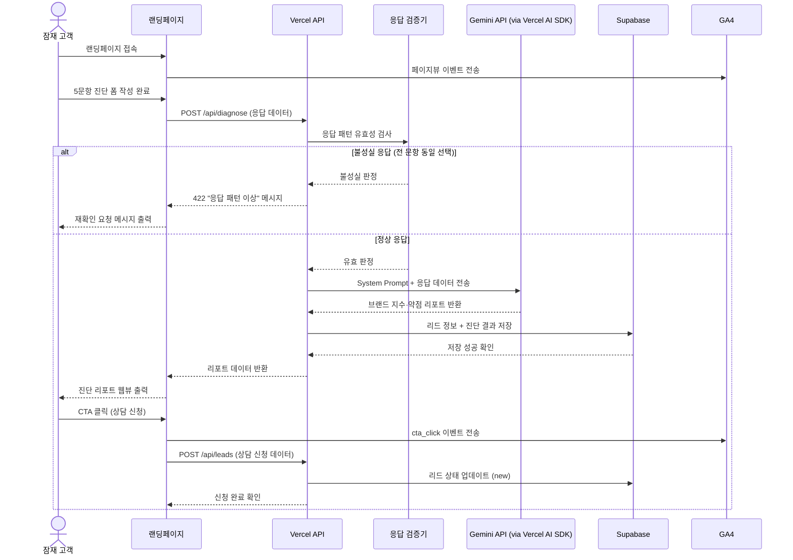
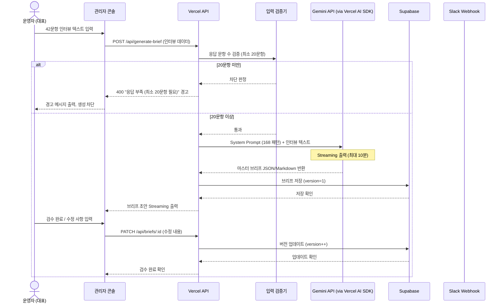
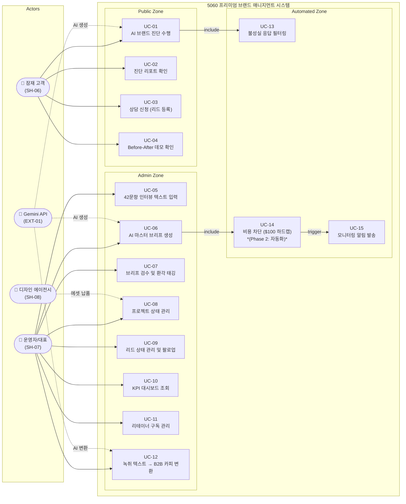
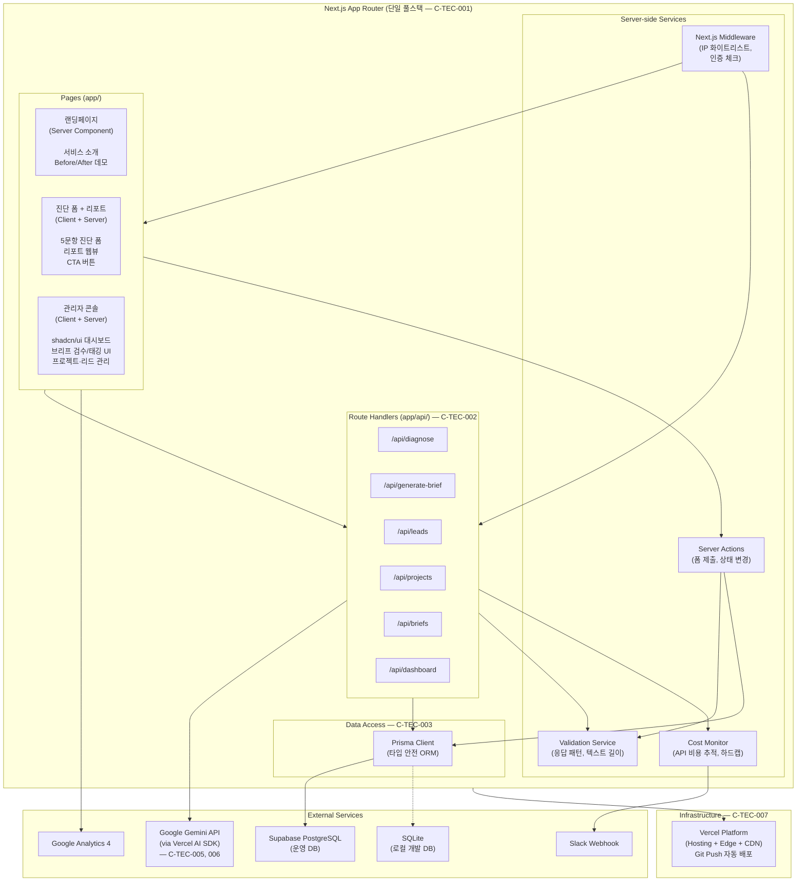
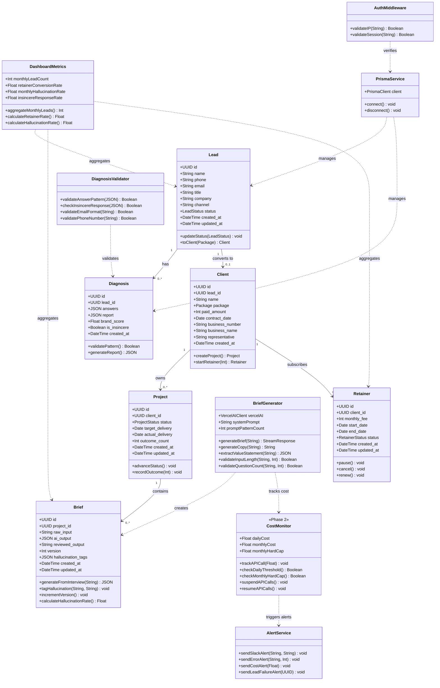
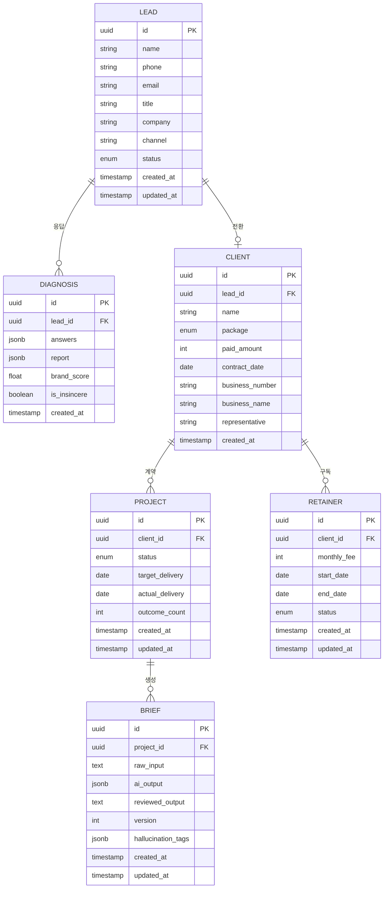
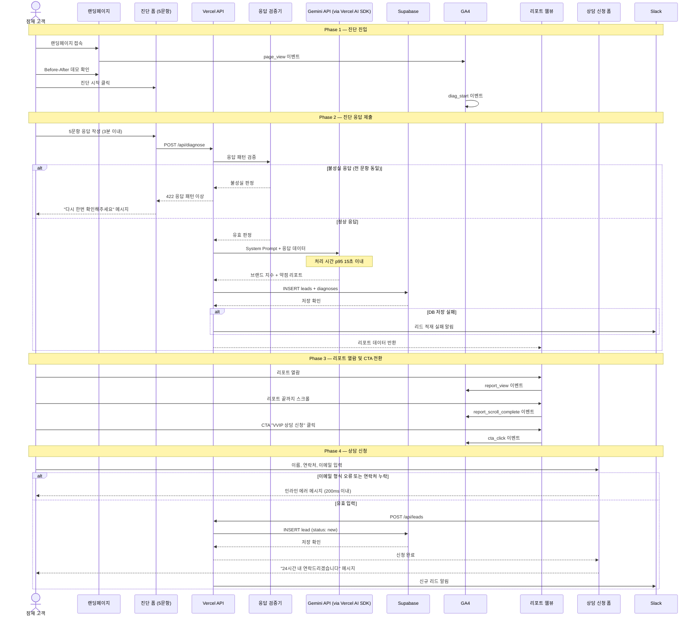
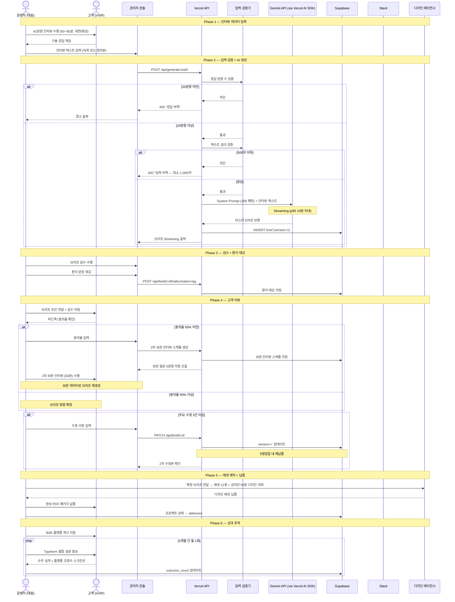
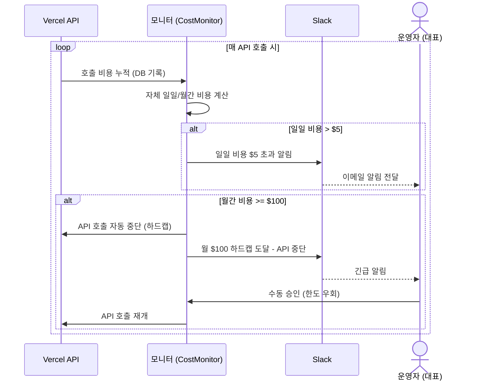
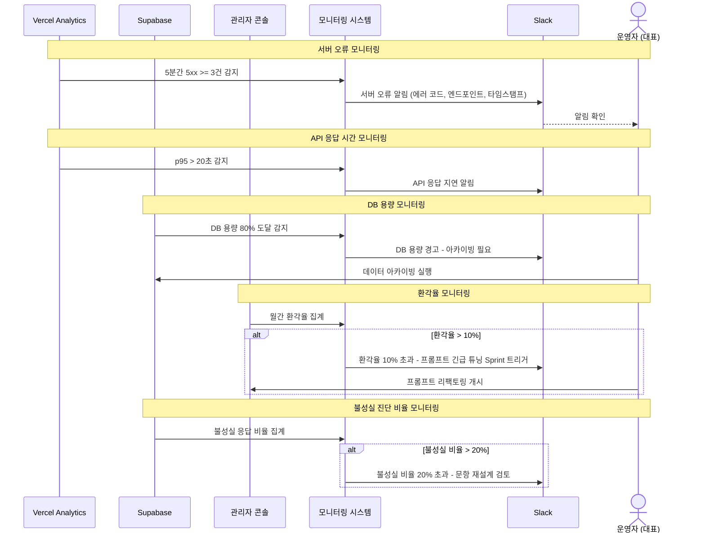

# Software Requirements Specification (SRS)

| 항목 | 내용 |
| :--- | :--- |
| **Document ID** | SRS-001 |
| **Revision** | 1.3 |
| **Date** | 2026-04-21 |
| **Standard** | ISO/IEC/IEEE 29148:2018 |
| **Source PRD** | PRD v0.2 — 5060 프리미엄 브랜드 매니지먼트 |
| **Status** | 🟡 Draft — 이해관계자 리뷰 대기 |

---

## 1. Introduction

### 1.1 Purpose

본 SRS는 **5060 프리미엄 브랜드 매니지먼트 시스템**(이하 "시스템")의 소프트웨어 요구사항을 ISO/IEC/IEEE 29148:2018 표준에 따라 정의한다.

시스템이 해결하는 문제:

| # | Pain | 현재 기준선 | 근거 |
| :---: | :--- | :--- | :--- |
| P1 | 경력 언어화 실패 — 직함은 있으나 ROI 기반 가치 제안 문장 부재 | B2B 제안서 완성률 ≤ 5% | PRD §1-1 JTBD 인터뷰 시뮬레이션 |
| P2 | 자산 분산·신뢰 저하 — 프로필·제안서·SNS 파편화 | B2B 플랫폼 프로필 조회수 0건/월, 컨택 전환율 0% | PRD §1-1 JTBD 인터뷰 시뮬레이션 |
| P3 | 실행 진입 장벽 — 디지털 도구 조작 거부 (체면·디지털 피로) | 서비스 자체 진행 시도율 < 10%, 외주 만족도 2.0/5.0 | PRD §1-1 JTBD 인터뷰 시뮬레이션 |
| P4 | 기존 대안 구조적 한계 — 전직 지원·코칭·매칭 플랫폼 이탈 | 기존 서비스 이용 후 B2B 수주 성공률 < 3%, 재구매율 < 15% | PRD §1-1 경쟁사 20+社 분석 결과 |

**본 문서의 독자:** 개발자(1인 바이브코딩), 운영자(대표), 디자인 에이전시, 이해관계자 리뷰어.

### 1.2 Scope

#### 1.2.1 In-Scope (MVP V1)

| # | 항목 | 매핑 기능 |
| :---: | :--- | :--- |
| S1 | AI 브랜드 진단 툴 (5문항, 웹 기반) | F2 |
| S2 | AI 마스터 브리프 생성기 (관리자 콘솔) | F1, F3 |
| S3 | 리드 DB 자동 적재 (Supabase) | F4 |
| S4 | 랜딩페이지 (Next.js) | — |
| S5 | 진단 결과 리포트 웹뷰 출력 | F2 |

#### 1.2.2 Out-of-Scope (V1 제외)

| # | 항목 | 대체 수단 |
| :---: | :--- | :--- |
| O1 | 결제 시스템 | 수동 계좌이체 |
| O2 | SNS 회원가입 / OAuth 로그인 | 관리자 직접 데이터 입력 |
| O3 | PPT 디자인 자동 Export (F8) | A급 디자인 에이전시 외주 |
| O4 | STT 음성 자동 변환 (F7) | 운영자 수동 녹취 |
| O5 | 모션 디자인 / 애니메이션 | — |
| O6 | 모바일 네이티브 앱 | 반응형 웹 대응 |

#### 1.2.3 Constraints (제약사항)

| ID | 제약 유형 | 내용 |
| :--- | :--- | :--- |
| CON-01 | 인프라 | Vercel Hobby 티어 (Serverless 실행 시간 ≤ 60초, 메모리 1024MB). **단, Streaming 엔드포인트(`/api/generate-brief`)는 Edge Runtime을 적용하여 실행 시간 제한을 완화한다.** |
| CON-02 | 인프라 | Supabase Free 티어 (500MB DB, 1GB Storage, 50K MAU) |
| CON-03 | 비용 | 월 운영비 하드캡 $100. MVP 1차에서는 Google AI Studio Dashboard 수동 모니터링으로 관리하며, 자동 중단 로직은 Phase 2에서 구현한다. |
| CON-04 | 운영 | 1인 운영 모델 — 월 프로젝트 상한 6건 |
| CON-05 | AI | **Gemini API 1M+ 토큰 컨텍스트 윈도우** (42문항 인터뷰 전문 + 프롬프트 패턴 168개를 단일 호출로 처리 가능) |
| CON-06 | 보안 | OWASP Top 10 준수, API Key 클라이언트 노출 0% |
| CON-07 | 아키텍처 | ADR: **Next.js App Router + Prisma ORM + Vercel AI SDK + Gemini API** 스택 고정 (C-TEC-001~007 준수) |
| CON-08 | 데이터베이스 | **Prisma datasource 전환**: 로컬 개발은 `SQLite` 또는 **Docker PostgreSQL**(JSONB 완전 호환 필요 시)을 사용하고, 운영 배포는 `Supabase PostgreSQL`로 `schema.prisma`의 datasource만 교체 (C-TEC-003). JSONB 필드 4개(`answers`, `report`, `ai_output`, `hallucination_tags`)의 로컬↔운영 호환성에 유의한다. |
| CON-09 | UI | **UI 프레임워크**: 관리자 콘솔은 Tailwind CSS + shadcn/ui 사용 강제. 공개 랜딩페이지는 자유 스타일링 허용. AI 코드 생성 일관성 보장 (C-TEC-004) |

#### 1.2.4 Assumptions (가정)

| ID | 가정 |
| :--- | :--- |
| ASM-01 | 5060 타깃의 880만 원 지불 의향은 JTBD 인터뷰 시뮬레이션에서 검증됨 (실 결제 검증은 파일럿 필요) |
| ASM-02 | **Gemini API 1M+ 토큰 컨텍스트**가 42문항 인터뷰 전체 텍스트 + 168개 프롬프트 패턴 처리에 충분함 |
| ASM-03 | 1인 운영자가 월 6건의 프로젝트를 AI 지원 하에 병렬 처리 가능 |
| ASM-04 | Vercel Hobby + Supabase Free 티어가 MVP 단계(월 리드 50건, 프로젝트 6건)의 트래픽을 감당함 |
| ASM-05 | Prisma ORM이 SQLite(로컬)와 PostgreSQL(운영) 간 **스키마 호환성**을 완전히 보장하며, 마이그레이션 스크립트(`prisma migrate`)로 양방향 전환 가능함 |
| ASM-06 | Vercel AI SDK의 표준 인터페이스(`generateText`, `streamText`)가 Gemini/Claude/GPT-4o 간 **동일한 호출 시그니처**를 제공하여 모델 교체 시 비즈니스 로직 수정을 최소화함 |

### 1.3 Definitions, Acronyms, Abbreviations

| 용어 | 정의 |
| :--- | :--- |
| **JTBD** | Jobs to be Done — 고객이 특정 상황에서 완수하고자 하는 과업 |
| **AOS** | Adjusted Opportunity Score — 조정된 기회 점수. 가중 중요도 × (2 × 중요도 − 만족도) |
| **DOS** | Discovered Opportunity Score — 탐색된 기회 점수. 질적 인터뷰 기반 미충족 니즈 강도 |
| **마스터 브리프** | 42문항 인터뷰 데이터를 AI가 구조화한 15페이지 분량의 핵심 전략 문서 (가치선언문, 타깃, 포지셔닝, 강의 주제 포함) |
| **에셋 12종** | 마스터 브리프 기반으로 제작되는 **브랜드 에셋 8종**(브랜드 로고, 브랜드 철학, 브랜드 슬로건, 키컬러, 명함, 커스텀 SNS 디자인, 브랜드 포토, 브랜드 스타일 영상)과 **B2B 산출물 4종**(제안서, 강의안 50장, 소개서, 프로필)으로 구성된 통합 납품 패키지 |
| **Done-for-you** | 고객이 인터뷰 구술만 참여하고, 나머지 전체 과정을 서비스가 100% 대행하는 모델 |
| **바이브코딩** | AI 도구를 활용한 1인 개발 방식 |
| **Validator** | PRD 내 주장의 타당성을 검증하는 실험 설계 및 측정 방법 |
| **Persona** | 서비스 타깃 사용자의 대표 유형을 모델링한 가상 인물 |
| **MoSCoW** | Must / Should / Could / Won't — 요구사항 우선순위 분류법 |
| **NPS** | Net Promoter Score — 순 추천 지수. (%추천자 − %비추천자) |
| **CTA** | Call to Action — 사용자의 행동(상담 신청 등)을 유도하는 UI 요소 |
| **환각 (Hallucination)** | AI가 입력 데이터에 없는 사실을 생성하는 오류 현상 |
| **RLS → App-level Auth** | 기존 Supabase RLS(행 단위 보안)을 대체하는 방식. Next.js Middleware + Prisma 쿼리 필터로 접근 제어를 애플리케이션 계층에서 구현 |
| **App Router** | Next.js 13+의 라우팅 아키텍처. `app/` 디렉토리 기반으로 서버/클라이언트 컴포넌트를 구분하고, Layout/Page/Loading/Error 패턴을 표준화 |
| **Server Actions** | Next.js App Router에서 클라이언트 폼 제출 등을 서버 측 함수로 직접 처리하는 RPC 패턴. 별도 API 엔드포인트 없이 DB 접근 가능 |
| **Route Handlers** | Next.js App Router에서 `app/api/*/route.ts` 파일로 정의하는 HTTP 엔드포인트. 기존 API Routes의 후속 |
| **Prisma ORM** | TypeScript 기반 ORM. 스키마 파일(`schema.prisma`)로 모델을 선언하고, 타입 안전한 쿼리 클라이언트를 자동 생성 |
| **Vercel AI SDK** | Vercel이 제공하는 AI 앱 개발 프레임워크. `ai` 패키지를 통해 LLM 호출, 스트리밍, 도구 사용을 표준화 |
| **shadcn/ui** | Radix UI 기반의 복사-붙여넣기 컴포넌트 라이브러리. Tailwind CSS로 스타일링되며, 프로젝트 내에 소스 코드로 존재 |
| **LCP** | Largest Contentful Paint — 최대 콘텐츠 렌더링 시간 (Core Web Vitals 지표) |

### 1.4 References

> 본 SRS의 유일한 비즈니스/기능 요구 원천은 **PRD v0.2** (`PRD__v1.0.md`)이다. 아래 표는 PRD 내에 직접 포함·인용된 근거 데이터의 출처를 PRD 섹션 기준으로 정리한 것이며, 별도 외부 파일을 참조하지 않는다.

| ID | 근거 내용 | PRD 내 반영 위치 |
| :--- | :--- | :--- |
| REF-01 | 경쟁사 분석 결과 (5개 시장 20+社) — 기존 대안의 구조적 한계, 수주 성공률 < 3% | PRD §1-1 Pain P4, §4 차별 가치 근거, §7 리스크 |
| REF-02 | Porter's 5 Forces 분석 (5개 시장) — 진입 장벽 및 경쟁 구조 | PRD §4 기능 요구사항 근거 |
| REF-03 | 가치사슬 분석 (10+社) — 서비스 차별화 포인트 도출 | PRD §4, §8 벤치마크 |
| REF-04 | KSF 보고서 (5개 시장 25개 성공 요인) — MoSCoW 우선순위 근거 | PRD §4 MoSCoW 근거 |
| REF-05 | 문제정의서 (3개 시장 9개 관점) — P1~P4 Pain 수치 근거 | PRD §1-1 문제 정의 |
| REF-06 | TAM-SAM-SOM 시장 규모 추정 — SOM 1,300억 원, 880만 원 객단가 근거 | PRD §1 시장 규모, §7 가정 (ASM-01) |
| REF-07 | 페르소나 스펙트럼 (12종) — AOS-DOS 사분면 기반 5인 Core/Adj 타깃 | PRD §2-1 페르소나 요약 |
| REF-08 | 고객 여정 지도 (CJM) — 문제 인식→탐색→의사결정→사용→유지 여정 | PRD §2-2 고객 여정 맵 |
| REF-09 | AOS-DOS 기회점수 분석 — Q1 High AOS/High DOS 우선순위 설정 | PRD §2-1 페르소나 우선순위 |
| REF-10 | JTBD 인터뷰 시뮬레이션 — "석 달째 빈 화면", "크몽 외주 속 빈 강정" 등 실제 고객 인용 | PRD §1-1 Pain 지표, §3 스토리, §9 근거 |
| REF-11 | Value Proposition Sheet V2 — Done-for-you 모델 정의, 수익 구조, AI 자동화 전략 | PRD 전체의 원천 전략 문서 (PRD §9-2 #11) |
| REF-12 | **PRD v0.2 (본 SRS의 유일한 원천)** | `PRD__v1.0.md` — 본 문서 |
| REF-13 | ISO/IEC/IEEE 29148:2018 | International Standard |

---

## 2. Stakeholders

| # | 역할 (Role) | 대표 페르소나 | 책임 (Responsibility) | 관심사 (Interest) |
| :---: | :--- | :--- | :--- | :--- |
| SH-01 | **Core 고객 — 전환기 임원** | 김명진 (55), 前 대기업 전략기획 임원 | 42문항 인터뷰 참여, 브리프 검수 피드백 제공 | B2B 제안서 확보로 고문 자문·특강 수주 (AOS 4.00 / DOS 3.60) |
| SH-02 | **Core 고객 — 아날로그 전문가** | 정재호 (59), 1금융권 영업본부장 | 음성 녹음 구술 제공, 산출물 품격 검수 | 디지털 도구 조작 없이 기업 무대 진출 (AOS 3.60 / DOS 2.80) |
| SH-03 | **Core 고객 — 연구직 전문가** | 박태현 (58), 국책연구소 수석연구원 | 딥테크 지식 제공, 기술 용어 검수 | R&D 전문지식의 B2B 커뮤니케이션 변환 (AOS 2.70 / DOS 1.75) |
| SH-04 | **Core 고객 — HR/코칭 전문가** | 이수아 (52), 외국계 HR 총괄 임원 | 경험 사례 제공, 기업교육 패키지 방향 검수 | 경험 → 기업교육 패키지 구조화 (AOS 2.40 / DOS 1.60) |
| SH-05 | **Adj 고객 — 스타트업 대표** | 윤성민 (48), B2B SaaS 스타트업 대표 | 인터뷰 참여 (최소 시간), 법인 결제 | 오너 PR·강의안 시그니처 콘텐츠 확보 (AOS 2.25 / DOS 1.60) |
| SH-06 | **잠재 고객 (리드)** | 5060 전문가 전체 | AI 진단 폼 참여, 상담 신청 | 자신의 브랜드 약점 객관적 파악, 서비스 필요성 체감 |
| SH-07 | **운영자 / 대표** | 시스템 소유자 (1인) | 인터뷰 수행, AI 결과 검수, 최종 납품, 리드 팔로업 | 월 6건 병렬 처리, 순이익률 ≥ 40% 방어 |
| SH-08 | **디자인 에이전시** | A급 외주 파트너 | 에셋 12종·강의안 50장 시각 디자인 제작 | 명확한 브리프 수령, 납기 준수 |

---

## 3. System Context and Interfaces

### 3.1 External Systems

| # | 외부 시스템 | 역할 | 통신 프로토콜 | 제약 | 장애 시 임시 우회 전략 |
| :---: | :--- | :--- | :--- | :--- | :--- |
| EXT-01 | **Google Gemini API** | AI 마스터 브리프 생성, 브랜드 진단 리포트 생성 | HTTPS (TLS 1.3) | Rate: RPM/TPM Tier 기반, Context: **1M+ tokens**, Cost: Flash ~$0.075/1M input | Supabase에 사전 캐싱된 **샘플 진단 리포트 템플릿**(업종별 3종) 반환 + Fallback 메시지 출력. 브리프 생성은 수동 대응 (SLA 4시간) 및 Vercel AI SDK의 provider 자동 전환 (fallback) 적용 |
| EXT-02 | **Supabase** | 리드 DB (PostgreSQL) + Storage. DB 접근은 Prisma ORM 경유, App-level 접근 제어 | HTTPS (Prisma via TCP/HTTP) | Free 티어: 500MB DB, 1GB Storage, 50K MAU | 로컬 JSON 파일 기반 **임시 리드 저장소**에 기록 후, Supabase 복구 시 일괄 동기화 (Batch Sync). 관리자 콘솔에 "오프라인 모드" 표시. |
| EXT-03 | **Vercel** | 호스팅, Serverless Functions, Edge CDN | HTTPS | Hobby: 실행 시간 ≤ 60초, 메모리 1024MB | Vercel 전체 장애 시 대응 불가 (호스팅 의존). 장애 감지 → Slack 알림 + 고객 안내 메일 발송. 사전에 **정적 HTML 랜딩페이지** 백업본을 별도 스토리지에 준비. |
| EXT-04 | **Google Analytics 4** | 페이지뷰·이벤트 트래킹, 전환 분석 | HTTPS (gtag.js) | GDPR 동의 배너 필요 | GA4 장애 시 운영자가 **수동으로 이벤트 로그를 기록**하여 전환 데이터 보존. GA4 복구 후 수동 대조. *(Phase 2: `event_logs` 테이블 자동 기록)* |
| EXT-05 | **Typeform** | NPS 설문, 월말 고객 자가 보고 | HTTPS (Webhook) | 무료 플랜 제약 내 | Typeform 장애 시 **Google Forms 대체 설문 링크** 사전 준비. 수집 데이터는 운영자가 수동으로 Supabase에 입력. |
| EXT-06 | **Slack** | 운영 알림 (오류, 비용, 리드 적재 실패) | HTTPS (Webhook) | Incoming Webhook | Slack 장애 시 **운영자 이메일(대표 개인 메일)**로 동일 알림 자동 발송. Vercel Functions 내 이메일 Fallback 로직 사전 구현. |

### 3.2 Client Applications

| # | 클라이언트 | 사용자 | 주요 기능 |
| :---: | :--- | :--- | :--- |
| CL-01 | **랜딩페이지 (Public Web)** | 잠재 고객 (SH-06) | 서비스 소개, AI 진단 폼 진입 |
| CL-02 | **AI 진단 결과 웹뷰** | 잠재 고객 (SH-06) | 브랜드 지수·약점 리포트 확인, CTA 클릭 |
| CL-03 | **관리자 콘솔 (Admin Web)** | 운영자 (SH-07) | 인터뷰 텍스트 입력, AI 변환 결과 확인, 검수, 리드 관리 |

### 3.3 API Overview

> **구현 방식 주석**: 아래 API는 Next.js App Router의 Route Handlers(`app/api/*/route.ts`)로 구현하며, 일부 admin 내부 호출은 Server Actions으로 대체 가능하다.

| API Endpoint | Method | 입력 | 출력 | 외부 시스템 | 매핑 기능 |
| :--- | :---: | :--- | :--- | :--- | :--- |
| `POST /api/diagnose` | POST | 5문항 진단 응답 (JSON) | 브랜드 지수·약점 리포트 (JSON) | Gemini API (via Vercel AI SDK), Prisma ORM → Supabase PostgreSQL | F2, F4 |
| `POST /api/leads` | POST | 리드 정보 (이름, 연락처, 진단 결과) | 저장 확인 (JSON) | Prisma ORM → Supabase PostgreSQL | F4 |
| `POST /api/generate-brief` | POST | 42문항 인터뷰 텍스트 (JSON) | 마스터 브리프 (JSON/Markdown, Streaming) | Gemini API (via Vercel AI SDK), Prisma ORM → Supabase PostgreSQL | F1, F3 |
| `GET /api/projects/:id` | GET | 프로젝트 ID | 프로젝트 상태·브리프 데이터 (JSON) | Prisma ORM → Supabase PostgreSQL | F3 |
| `PATCH /api/briefs/:id` | PATCH | 검수 수정 내용 (JSON) | 버전 업데이트 확인 (JSON) | Prisma ORM → Supabase PostgreSQL | F3 |
| `GET /api/leads` | GET | 필터 파라미터 (상태, 날짜) | 리드 목록 (JSON) | Prisma ORM → Supabase PostgreSQL | F4 |
| `POST /api/validate-diagnosis` | POST | 5문항 응답 패턴 (JSON) | 유효성 검증 결과 (JSON) | — | F2 |
| `PATCH /api/leads/:id/status` | PATCH | 리드 ID, 변경 상태 (JSON) | 상태 업데이트 확인 (JSON) | Prisma ORM → Supabase PostgreSQL | F4 |
| `POST /api/briefs/:id/hallucination-tag` | POST | 환각 문장 ID, 태깅 데이터 (JSON) | 태깅 저장 확인 (JSON) | Prisma ORM → Supabase PostgreSQL | F1, F3 |
| `GET /api/dashboard/metrics` | GET | 기간 필터 (월/분기) | KPI 집계 데이터 (JSON) | Prisma ORM → Supabase PostgreSQL | F3, F4, F6 |

### 3.4 Interaction Sequences (핵심 시퀀스 다이어그램)

#### 3.4.1 AI 브랜드 진단 플로우 (리드 퍼널)

#### 3.4.2 AI 마스터 브리프 생성 플로우 (핵심 서비스)

### 3.5 UseCase Diagram

시스템의 주요 액터와 비즈니스 기능 간의 사용 사례를 정의한다.

| UC ID | Use Case | 주요 액터 | 관련 REQ |
| :--- | :--- | :--- | :--- |
| UC-01 | AI 브랜드 진단 수행 | 잠재 고객 | REQ-FUNC-008, 009, 012 |
| UC-02 | 진단 리포트 확인 | 잠재 고객 | REQ-FUNC-010, 011 |
| UC-03 | 상담 신청 (리드 등록) | 잠재 고객 | REQ-FUNC-019, 020 |
| UC-04 | Before-After 데모 확인 | 잠재 고객 | REQ-FUNC-028 |
| UC-05 | 42문항 인터뷰 텍스트 입력 | 운영자 | REQ-FUNC-001, 003 |
| UC-06 | AI 마스터 브리프 생성 | 운영자, Gemini API | REQ-FUNC-001, 002, 004 |
| UC-07 | 브리프 검수 및 환각 태깅 | 운영자 | REQ-FUNC-006, 007, 018 |
| UC-08 | 프로젝트 상태 관리 | 운영자 | REQ-FUNC-017 |
| UC-09 | 리드 상태 관리 및 팔로업 | 운영자 | REQ-FUNC-021, 022, 023 |
| UC-10 | KPI 대시보드 조회 | 운영자 | REQ-FUNC-023, 027 |
| UC-11 | 리테이너 구독 관리 | 운영자 | REQ-FUNC-026 |
| UC-12 | 녹취 텍스트 → B2B 카피 변환 | 운영자, Gemini API | REQ-FUNC-014, 015 |
| UC-13 | 불성실 응답 필터링 | 시스템 (자동) | REQ-FUNC-009, REQ-NF-023 |
| UC-14 | 비용 차단 ($100 하드캡) *(MVP: 수동 모니터링, Phase 2: 자동화)* | 시스템 (수동→자동) | REQ-NF-016 |
| UC-15 | 모니터링 알림 발송 | 시스템 (자동) | REQ-NF-018, 019, 020 |

### 3.6 System Architecture (Component Diagram)

시스템의 기술 스택 및 컴포넌트 간 의존 관계를 정의한다.

| 컴포넌트 | 기술 | 역할 | 제약 (CON) |
| :--- | :--- | :--- | :--- |
| **Next.js App Router** | Next.js 13+ (React) | 단일 풀스택 프레임워크 (Pages, API, Actions 통합) | CON-07 |
| **Route / Actions** | Server Actions & Route Handlers | RESTful API, Streaming 지원, 로직 처리 | CON-01 |
| **Validation Engine** | JavaScript/TypeScript | 입력 유효성 검증, 불성실 패턴 탐지 | — |
| **Cost Monitor** | TypeScript | Gemini API 비용 추적 *(MVP: Google AI Studio 수동 모니터링, Phase 2: 자동 차단)* | CON-03 ($100 하드캡) |
| **Data Access** | Prisma ORM | DB 추상화, 타입 안전 타입 제공 | CON-08 |
| **AI Engine** | Google Gemini API + Vercel AI SDK | AI 텍스트 생성 (진단, 브리프, 카피) | CON-05 (1M 토큰) |
| **Database** | PostgreSQL (Supabase) / SQLite | 데이터 영속화 | CON-02 |
| **Auth/Security** | Next.js Middleware | App-level IP 화이트리스트, 접근 제어 방어 | CON-06 |
| **UI Framework** | Tailwind CSS + shadcn/ui | 일관된 디자인 시스템 적용 | CON-09 |

### 3.7 Domain Object Model (Class Diagram)

코드베이스의 프론트엔드/백엔드 주요 도메인 객체 간 관계를 정의한다.

| 계층 | 클래스 | 역할 |
| :--- | :--- | :--- |
| **Domain Entity** | Lead, Diagnosis, Client, Project, Brief, Retainer | 비즈니스 데이터 모델 및 상태 관리 |
| **Data Access** | PrismaService | Prisma Client 싱글톤 관리, 트랜잭션 래퍼 |
| **Security Service** | AuthMiddleware | Next.js Middleware 기반 인증/인가 |
| **Validation Service** | DiagnosisValidator | 진단 응답 패턴 검증, 폼 유효성 검사 |
| **AI Service** | BriefGenerator | Gemini API 호출(Vercel AI SDK), 프롬프트 관리, 입력 유효성 검증 |
| **Ops Service** | CostMonitor, AlertService | 비용 추적/차단, Slack 알림 발송 |
| **Analytics Service** | DashboardMetrics | KPI 집계, 환각율/불성실 비율 산출 |

---

## 4. Specific Requirements

### 4.1 Functional Requirements

#### 4.1.1 F1 — AI 마스터 브리프 생성기 (Core Engine)

| ID | 요구사항 | Source | Priority | Acceptance Criteria |
| :--- | :--- | :--- | :---: | :--- |
| **REQ-FUNC-001** | 시스템은 42문항 인터뷰 텍스트를 입력받아 **최소 20개, 목표 168개** 프롬프트 패턴을 적용하여 15페이지 분량의 마스터 브리프 초안을 자동 생성해야 한다. | Story 1 (AC1), F1 | Must | **Given** 고객의 42문항 인터뷰 텍스트(20문항 이상 응답)가 입력된 상태 **When** 운영자가 관리자 콘솔에서 브리프 생성을 요청하면 **Then** Vercel AI SDK를 통해 15p 분량의 마스터 브리프 초안이 30분 이내에 자동 생성된다. (MVP 1차: 코어 패턴 20개로 시작, 점진 확장) |
| **REQ-FUNC-002** | 시스템은 마스터 브리프 생성 시 Streaming 방식으로 결과를 출력하여 운영자가 실시간으로 생성 과정을 확인할 수 있어야 한다. | F1 | Must | **Given** 브리프 생성 요청이 Gemini API (via Vercel AI SDK)로 전송된 상태 **When** AI가 응답을 생성하는 동안 **Then** 관리자 콘솔에 텍스트가 Streaming 방식으로 즉시 표시되며, 전체 생성 완료까지 빈 화면 대기 시간이 0초이다. |
| **REQ-FUNC-003** | 시스템은 인터뷰 응답이 20문항 미만인 경우 브리프 생성을 차단하고 "응답 부족 (최소 20문항 필요)" 경고를 출력해야 한다. | Story 1 (AC1-N) | Must | **Given** 입력된 인터뷰 텍스트가 20문항 미만인 상태 **When** 브리프 생성 요청이 제출되면 **Then** 시스템이 HTTP 400과 함께 "응답 부족 (최소 20문항 필요)" 메시지를 반환하고, Gemini API 호출이 발생하지 않는다. 차단 정확도 100%. |
| **REQ-FUNC-004** | 시스템은 마스터 브리프에서 가치선언문, 핵심 타깃, 강의 주제 3종을 자동 도출해야 한다. | Story 4 (AC1), F1 | Must | **Given** 42문항 인터뷰 데이터가 AI 엔진에 입력된 상태 **When** 마스터 브리프 생성이 완료되면 **Then** 가치선언문(1건), 핵심 타깃(1건), 강의 주제(3종)가 브리프 내 별도 섹션으로 구조화되어 출력된다. |
| **REQ-FUNC-005** | 시스템은 AI 도출 결과에 대한 고객 동의율이 50% 미만일 경우, 2차 보완 인터뷰 스케줄을 자동 생성하고 보완 질문 5문항을 사전 발송해야 한다. | Story 4 (AC1-N) | Should *(Phase 2)* | **Given** 브리프 검수 미팅에서 고객 동의율이 50% 미만으로 기록된 상태 **When** 운영자가 동의율을 관리자 콘솔에 입력하면 **Then** 시스템이 1영업일 이내에 2차 보완 인터뷰(30분) 스케줄 생성 + 보완 질문 5문항을 자동 산출한다. |
| **REQ-FUNC-006** | 시스템은 마스터 브리프의 버전 관리를 지원하여, 검수 수정 시마다 `briefs.version`을 자동 증가시키고 이전 버전을 보존해야 한다. | Story 1 (AC2-N), F1 | Must | **Given** 운영자가 검수 후 수정 사항을 입력한 상태 **When** 수정 내용이 저장되면 **Then** `briefs.version`이 1 증가하고, 이전 버전의 `ai_output`과 `reviewed_output`이 그대로 보존된다. |
| **REQ-FUNC-007** | 시스템은 생성된 브리프의 AI 환각(Hallucination) 문장에 대해 운영자 태깅 기능을 제공하여, 월간 환각율을 산출할 수 있어야 한다. | F1, 모니터링 | Should *(Phase 2, MVP에서는 수동 엑셀 집계)* | **Given** 운영자가 브리프 검수 화면에서 특정 문장을 환각으로 태깅한 상태 **When** 월간 검수 데이터가 집계되면 **Then** 월간 환각율(환각 태깅 문장 수 / 전체 검수 문장 수 × 100)이 자동 산출되어 대시보드에 표시된다. |

#### 4.1.2 F2 — AI 브랜드 진단 툴 (Lead Funnel)

| ID | 요구사항 | Source | Priority | Acceptance Criteria |
| :--- | :--- | :--- | :---: | :--- |
| **REQ-FUNC-008** | 시스템은 잠재 고객에게 5문항 객관식 진단 폼을 제공하고, 응답 완료 시 Gemini API (via Vercel AI SDK)를 통해 브랜드 지수(0~100점)와 약점 분석 리포트를 즉시 생성해야 한다. | Story 3 (AC1), F2 | Must | **Given** 잠재 고객이 랜딩페이지에서 5문항 진단 폼을 완료한 상태 **When** 폼이 제출되면 **Then** 10초 이내에 브랜드 지수(0~100점)와 약점 분석 리포트가 웹뷰에 출력된다. 폼 완료율 ≥ 60%. |
| **REQ-FUNC-009** | 시스템은 5문항 전체에서 동일 선택지를 고른 불성실 응답을 탐지하고, "응답 패턴 이상 — 다시 한번 확인해주세요" 메시지를 출력하며 리포트 생성을 차단해야 한다. | Story 3 (AC1-N), F2 | Must | **Given** 5문항 모두 동일 선택지가 선택된 상태 **When** 진단 폼이 제출되면 **Then** 시스템이 "응답 패턴 이상 — 다시 한번 확인해주세요" 메시지를 출력하고 Gemini API 호출 및 리포트 생성을 차단한다. 불성실 필터 정확도 ≥ 95%, 정상 응답 오차단율 < 2%. |
| **REQ-FUNC-010** | 시스템은 진단 리포트 하단에 VVIP 매니지먼트 상담 신청 CTA 버튼을 노출하고, CTA 클릭 시 상담 신청 폼으로 이동시켜야 한다. | Story 3 (AC2), F2 | Must | **Given** 진단 리포트가 웹뷰에 출력된 상태 **When** 고객이 리포트를 스크롤하여 하단에 도달하면 **Then** "VVIP 매니지먼트 상담 신청" CTA 버튼이 명확히 노출되며, 클릭 시 상담 신청 폼 페이지로 이동한다. |
| **REQ-FUNC-011** | 시스템은 CTA 클릭 이벤트를 GA4에 `cta_click`으로 전송하여 전환율 측정을 지원해야 한다. 리포트 완독 이벤트(`report_scroll_complete`) 트래킹은 Phase 2에서 추가한다. | Story 3 (AC2), 보조 KPI 5 | Must | **Given** 고객이 리포트 페이지에서 CTA를 클릭한 상태 **When** 클릭 이벤트가 발생하면 **Then** `cta_click` 이벤트가 GA4로 즉시 전송된다. 이벤트 전송 실패율 < 1%. |
| **REQ-FUNC-012** | 시스템은 진단 폼을 객관식 90% + 단답형 10% 구성으로 제공하며, 3분 이내에 완료 가능하도록 설계해야 한다. | 리스크 R3 | Must | **Given** 잠재 고객이 진단 폼에 접근한 상태 **When** 폼 작성을 시작하면 **Then** 폼은 5문항(객관식 4~5문항 + 단답형 0~1문항)으로 구성되며, 평균 완료 소요시간이 3분 이내이다. |

#### 4.1.3 F3 — 관리자 콘솔 (Back-Stage)

| ID | 요구사항 | Source | Priority | Acceptance Criteria |
| :--- | :--- | :--- | :---: | :--- |
| **REQ-FUNC-013** | 관리자 콘솔은 인터뷰 Raw 텍스트를 입력하면, AI 변환 결과(가치선언문, 핵심 타깃, 강의안 목차, 제안서 뼈대)를 텍스트로 일괄 반환하는 UI를 제공해야 한다. | F3 | Must | **Given** 운영자가 관리자 콘솔에 인터뷰 Raw 텍스트를 입력한 상태 **When** "AI 변환" 버튼을 클릭하면 **Then** 가치선언문, 핵심 타깃, 강의안 목차, 제안서 뼈대가 각각 구분된 섹션으로 일괄 반환되어 화면에 표시된다. |
| **REQ-FUNC-014** | 관리자 콘솔은 구술 녹취 텍스트(음성→텍스트 변환 결과)를 입력받아 논리적 구조를 갖춘 B2B 제안 카피로 자동 변환하는 기능을 제공해야 한다. | Story 2 (AC1) | Must | **Given** 운영자가 고객의 녹취 텍스트(1,000자 이상)를 콘솔에 입력한 상태 **When** 변환 요청을 실행하면 **Then** 1시간 이내에 논리적 구조를 갖춘 B2B 제안 카피가 생성되며, 핵심 메시지 반영률 ≥ 90%. |
| **REQ-FUNC-015** | 관리자 콘솔은 녹취 텍스트가 500자 이하이거나 핵심 키워드 추출이 불가능한 경우, "입력 부족 — 최소 1,000자 이상 필요" 경고를 출력하고 AI 생성을 차단해야 한다. | Story 2 (AC1-N) | Must | **Given** 입력된 녹취 텍스트가 500자 이하인 상태 **When** 변환 요청이 제출되면 **Then** 시스템이 "입력 부족 — 최소 1,000자 이상 필요" 경고를 출력하고 Gemini API 호출을 차단한다. 경고 출력 정확도 100%. |
| **REQ-FUNC-016** | 관리자 콘솔은 App-level 접근 제어(Next.js Middleware + Prisma 쿼리 필터) 및 IP 화이트리스트를 적용하여, 미등록 IP에서의 Admin 라우트 접속을 원천 차단해야 한다. | NFR 보안 | Must | **Given** 미등록 IP에서 관리자 콘솔 접속을 시도한 상태 **When** 로그인 페이지에 접근하면 **Then** Next.js Middleware가 접속을 즉시 차단하고, 차단 로그가 기록되며, Slack 알림이 발송된다. 차단율 100%. |
| **REQ-FUNC-017** | 관리자 콘솔은 진행 중인 프로젝트 목록(상태, 납기, 고객 정보)을 대시보드 형태로 제공하여, 운영자가 최대 6건의 프로젝트를 병렬 관리할 수 있어야 한다. | F3, CON-04 | Must | **Given** 운영자가 관리자 콘솔 대시보드에 접속한 상태 **When** 대시보드가 로드되면 **Then** 진행 중인 전체 프로젝트가 상태(`interview`→`brief`→`asset`→`review`→`delivered`), 납기(`target_delivery`), 고객명과 함께 표시된다. |
| **REQ-FUNC-018** | 관리자 콘솔은 검수 완료된 브리프에 대해 환각 문장 태깅 UI를 제공하여 운영자가 특정 문장을 클릭하여 "환각"으로 마킹할 수 있어야 한다. | F3, 모니터링 | Should *(Phase 2, MVP에서는 운영자가 브리프 텍스트에 수동 마크업)* | **Given** 브리프 검수 화면에서 운영자가 특정 문장을 선택한 상태 **When** "환각 태깅" 버튼을 클릭하면 **Then** 해당 문장이 환각으로 마킹되고, 태깅 데이터가 Supabase에 저장된다. |

#### 4.1.4 F4 — 리드 DB (Supabase)

| ID | 요구사항 | Source | Priority | Acceptance Criteria |
| :--- | :--- | :--- | :---: | :--- |
| **REQ-FUNC-019** | 시스템은 상담 신청 폼 제출 시 리드 정보(이름, 연락처, 이메일, 직함, 유입 채널, 진단 결과)를 Supabase `leads` 테이블에 즉시 저장해야 한다. | Story 3 (AC3), F4 | Must | **Given** 잠재 고객이 상담 신청 폼을 작성 완료한 상태 **When** 제출 버튼을 클릭하면 **Then** 리드 정보가 Supabase `leads` 테이블에 즉시 저장되며, 데이터 저장 성공률 ≥ 99.5%. |
| **REQ-FUNC-020** | 시스템은 상담 신청 폼에서 이메일 형식 오류 또는 연락처 누락 시 해당 필드에 즉시 인라인 에러 메시지를 노출하고 제출을 차단해야 한다. | Story 3 (AC3-N), F4 | Must | **Given** 이메일 형식이 잘못되었거나 연락처가 누락된 상태 **When** 제출 버튼을 클릭하면 **Then** 해당 필드 하단에 200ms 이내로 인라인 에러 메시지가 출력되고, 잘못된 데이터의 DB 저장이 0건으로 차단된다. |
| **REQ-FUNC-021** | 시스템은 리드 상태를 `new` → `contacted` → `converted` → `lost` 순으로 관리하며, 상태 변경 시 변경 일시를 자동 기록해야 한다. | F4 | Must | **Given** 리드가 `new` 상태로 저장된 상태 **When** 운영자가 관리자 콘솔에서 상태를 변경하면 **Then** 상태가 지정된 값으로 업데이트되고, 변경 일시가 자동 기록된다. |
| **REQ-FUNC-022** | 시스템은 리드 적재 실패 시 즉시 Slack 알림을 발송해야 한다. | 모니터링 | Must | **Given** `POST /api/leads` 요청에서 Supabase 저장이 실패한 상태 **When** 실패가 감지되면 **Then** 1분 이내에 Slack Webhook을 통해 실패 알림(리드 정보, 에러 코드, 타임스탬프)이 발송된다. |
| **REQ-FUNC-023** | 시스템은 리드 DB에서 월별 신규 리드 수를 `leads.created_at` 기반으로 집계할 수 있어야 한다. | 보조 KPI 6, F4 | Must | **Given** 운영자가 월간 리드 수를 확인하고자 하는 상태 **When** Prisma Studio 또는 Supabase Dashboard에서 조회하면 **Then** 당월 신규 리드 수가 `leads.created_at` 월별 COUNT로 산출된다. (MVP에서는 외부 도구 직접 조회. 대시보드 자동 표시는 Phase 2) |

#### 4.1.5 F5 — 고객 맞춤형 트래킹 대시보드 (Should)

| ID | 요구사항 | Source | Priority | Acceptance Criteria |
| :--- | :--- | :--- | :---: | :--- |
| **REQ-FUNC-024** | 시스템은 고객이 자산화 진척 현황(브리프 완성 → 에셋 제작 → 제안서 완성 → 납품)을 실시간으로 조회할 수 있는 웹 대시보드를 제공해야 한다. | F5 | Should | **Given** 고객이 자신의 프로젝트 대시보드 URL에 접속한 상태 **When** 페이지가 로드되면 **Then** 프로젝트 상태(`interview`→`brief`→`asset`→`review`→`delivered`)가 진행률 바와 함께 실시간으로 표시된다. |
| **REQ-FUNC-025** | 시스템은 대시보드 사용 코호트와 미사용 코호트 간 NPS 차이를 A/B 테스트할 수 있도록, 대시보드 접속 여부를 사용자별로 기록해야 한다. | F5 | Should | **Given** 고객이 대시보드에 접속한 상태 **When** 접속 이벤트가 발생하면 **Then** 접속 일시와 사용자 ID가 기록되어 코호트별 NPS 비교 분석이 가능하다. |

#### 4.1.6 F6 — 리테이너 구독 관리 (Should)

| ID | 요구사항 | Source | Priority | Acceptance Criteria |
| :--- | :--- | :--- | :---: | :--- |
| **REQ-FUNC-026** | 시스템은 리테이너 구독 정보(월정액 50~100만 원, 시작일, 종료일, 상태)를 관리하고, 구독 갱신·해지 이력을 추적해야 한다. | F6 | Should | **Given** 운영자가 고객의 리테이너 구독을 등록한 상태 **When** 구독 상태 변경(갱신/일시정지/해지)이 발생하면 **Then** `retainers` 테이블에 상태 변경과 일시가 기록되며, 구독 이력 전체를 조회할 수 있다. |
| **REQ-FUNC-027** | 시스템은 Option B 완료 고객 대비 리테이너 전환율을 자동 산출하여 관리자 대시보드에 표시해야 한다. | 보조 KPI 4, F6 | Should | **Given** 운영자가 관리자 대시보드에 접속한 상태 **When** 리테이너 전환율 섹션을 조회하면 **Then** (리테이너 전환 고객 수 / Option B 납품 완료 고객 수) × 100이 분기별로 자동 산출되어 표시된다. |

#### 4.1.7 공통 기능 요구사항

| ID | 요구사항 | Source | Priority | Acceptance Criteria |
| :--- | :--- | :--- | :---: | :--- |
| **REQ-FUNC-028** | 시스템은 랜딩페이지에서 Before-After 데모(서비스 적용 전후 비교)를 시각적으로 제공하여, 잠재 고객이 서비스 효과를 즉시 인지할 수 있어야 한다. | 고객 여정 (의사결정 단계) | Must | **Given** 잠재 고객이 랜딩페이지에 접속한 상태 **When** Before-After 섹션으로 스크롤하면 **Then** 서비스 적용 전(Pain)과 적용 후(Outcome)의 비교가 시각적으로 명확히 구분되어 표시된다. |
| **REQ-FUNC-029** | 시스템은 세금계산서 발행에 필요한 고객 법인 정보(사업자등록번호, 상호, 대표자명)를 관리자 콘솔에서 입력하고 저장할 수 있어야 한다. | Story 4 (AC3) | Should | **Given** 운영자가 고객의 법인 정보를 입력한 상태 **When** 저장 버튼을 클릭하면 **Then** 법인 정보가 `clients` 테이블에 저장되며, 세금계산서 발행 시 해당 정보를 조회할 수 있다. |
| **REQ-FUNC-030** | 시스템은 Gemini API 장애 시 "현재 AI 분석 서비스가 일시적으로 지연되고 있습니다. 4시간 내에 결과를 전달드리겠습니다." Fallback 메시지를 사용자에게 출력해야 한다. | NFR 신뢰성 | Must | **Given** Gemini API 호출이 타임아웃 또는 5xx 에러를 반환한 상태 **When** 시스템이 에러를 감지하면 **Then** 사용자에게 Fallback 메시지가 출력되고, 운영자 Slack에 장애 알림이 발송된다. |

### 4.2 Non-Functional Requirements

#### 4.2.1 성능 (Performance)

| ID | 요구사항 | 측정 기준 | 측정 도구 | Source |
| :--- | :--- | :--- | :--- | :--- |
| **REQ-NF-001** | 진단 리포트 생성 응답 시간은 p95 기준 15초 이내여야 한다. | p95 ≤ 15초 (Gemini API 호출 포함) | Vercel Functions Log | PRD §5-1, Story 3 (AC1) |
| **REQ-NF-002** | 마스터 브리프 생성 응답 시간은 p95 기준 10분 이내여야 한다. | p95 ≤ 10분 (15p 분량, Streaming 출력) | Vercel Functions Log, `briefs.created_at` 타임스탬프 | PRD §5-1, 보조 KPI 1 |
| **REQ-NF-003** | 랜딩페이지 초기 로딩 LCP는 2.5초 이내여야 한다. | LCP ≤ 2.5초 | Lighthouse, Web Vitals | PRD §5-1 |
| **REQ-NF-004** | 시스템은 사용자당 시간당 50회 이상의 API 요청을 처리할 수 있어야 한다. | ≥ 50 req/hr per user | Vercel Analytics | PRD §5-1 |
| **REQ-NF-005** | 상담 신청 폼의 인라인 에러 메시지 출력 지연은 200ms 이내여야 한다. | ≤ 200ms | 브라우저 DevTools (Performance 탭) | Story 3 (AC3-N) |

#### 4.2.2 가용성 (Availability)

| ID | 요구사항 | 측정 기준 | 측정 도구 | Source |
| :--- | :--- | :--- | :--- | :--- |
| **REQ-NF-006** | 시스템 월 가용성(Uptime)은 99.0% 이상이어야 한다. (월 다운타임 ≤ 7.3시간) | Uptime ≥ 99.0% | Vercel Status, 외부 모니터링 | PRD §5-2 |
| **REQ-NF-007** | 서버 오류율(5xx)은 전체 요청의 1.0% 이하여야 한다. | 5xx 비율 ≤ 1.0% | Vercel Analytics | PRD §5-2 |
| **REQ-NF-008** | 데이터 백업은 주 1회 이상 수행되어야 한다. *(참고: Supabase Free 티어는 자동 백업 미지원. `pg_dump` 크론 스크립트 또는 수동 백업으로 대체.)* | 백업 주기: 주 1회 이상 | `pg_dump` 로그 / 수동 백업 기록 | PRD §5-2 |
| **REQ-NF-009** | Gemini API 장애 시 수동 Fallback 프로세스가 4시간 이내에 완료되어야 한다. | Fallback SLA ≤ 4시간 | Slack 알림 타임스탬프, 수동 처리 로그 | PRD §5-2 |

#### 4.2.3 보안 (Security)

| ID | 요구사항 | 측정 기준 | 측정 도구 | Source |
| :--- | :--- | :--- | :--- | :--- |
| **REQ-NF-010** | 고객 인터뷰 데이터는 저장 시 AES-256, 전송 시 TLS 1.3으로 암호화되어야 한다. | SSL Labs 테스트 A+ 등급 | SSL Labs 온라인 테스트 | PRD §5-3 |
| **REQ-NF-011** | 개인정보 수집은 최소 수집 원칙(이름, 연락처, 직함, 진단 결과)을 준수하고, 개인정보처리방침을 웹사이트에 게시해야 한다. | 수집 항목 외 데이터 저장 0건 | 분기 1회 셀프 감사 | PRD §5-3 |
| **REQ-NF-012** | API Key는 Vercel Environment Variables에만 저장하며, 클라이언트 코드에 노출되지 않아야 한다. | 클라이언트 노출 0% | 배포 시 `git grep` 자동 스캔 — 하드코딩 키 0건 | PRD §5-3 |
| **REQ-NF-013** | 관리자 콘솔은 App-level (Next.js Middleware) 접근 제어 및 IP 화이트리스트 기반 방어를 적용해야 한다. | 미등록 IP 접속 차단율 100%, 차단 로그 즉시 알림 | Middleware 로그, Slack 알림 | PRD §5-3 |
| **REQ-NF-014** | 분기 1회 OWASP Top 10 셀프 스캔(OWASP ZAP)을 수행하여, XSS·SQLi·CSRF 취약점 0건을 유지해야 한다. | 취약점 0건 (발견 시 7일 내 패치) | OWASP ZAP 보고서 | PRD §5-3 |

#### 4.2.4 비용 (Cost)

| ID | 요구사항 | 측정 기준 | 측정 도구 | Source |
| :--- | :--- | :--- | :--- | :--- |
| **REQ-NF-015** | 월간 총 운영비는 $100(하드캡) 이내여야 한다. | 월 비용 ≤ $100 | Google AI Studio Dashboard, Vercel Dashboard | PRD §5-4 |
| **REQ-NF-016** | Gemini API 비용이 월 $100에 도달하면 API 호출을 중단하고, 대표 수동 승인 후에만 재개해야 한다. | $100 도달 시 중단 | Google AI Studio Dashboard 수동 확인 (월 1회) | PRD §5-4 | *(MVP에서는 수동 모니터링. 자동 CostMonitor 구현은 Phase 2)* |
| **REQ-NF-017** | Supabase DB 용량이 80%에 도달하면 Slack 알림을 발송하고 데이터 아카이빙을 실행해야 한다. | DB 80% 도달 시 알림 + 아카이빙 | Supabase 용량 모니터링, Slack 알림 | PRD §5-4 |

#### 4.2.5 모니터링 (Monitoring)

| ID | 요구사항 | 측정 기준 | 측정 도구 | Source |
| :--- | :--- | :--- | :--- | :--- |
| **REQ-NF-018** | 5분간 5xx 에러 3건 이상 발생 시 Slack 알림이 자동 발송되어야 한다. | 5분간 5xx ≥ 3건 → Slack 알림 | Vercel Analytics + Slack Webhook | PRD §5-5 |
| **REQ-NF-019** | API 응답 시간 p95가 20초를 초과하면 Slack 알림이 자동 발송되어야 한다. | p95 > 20초 → Slack 알림 | Vercel Functions Log + Slack Webhook | PRD §5-5 |
| **REQ-NF-020** | 월간 환각율(환각 태깅 문장 수 / 전체 검수 문장 수 × 100)이 10%를 초과하면 프롬프트 긴급 튜닝 Sprint가 트리거되어야 한다. | 환각율 > 10% → 긴급 Sprint | 관리자 콘솔 검수 태깅 집계 | PRD §5-5, 리스크 R1 |

#### 4.2.6 Scalability & Maintainability

| ID | 요구사항 | 측정 기준 | Source |
| :--- | :--- | :--- | :--- |
| **REQ-NF-021** | 시스템은 월 리드 50건, 동시 프로젝트 6건의 부하를 처리할 수 있어야 한다. | 리드 50건/월, 프로젝트 6건/월 동시 처리 시 성능 저하 0% | ASM-03, ASM-04 |
| **REQ-NF-022** | Vercel AI SDK를 활용하여 Gemini, Claude, GPT-4o 간 대체 모델 전환이 코드 수정 최소화(환경변수 변경 등)를 통해 즉시 완료 가능하도록 구현해야 한다. | LLM 전환 소요시간 ≤ 1시간 | 리스크 R4 |
| **REQ-NF-023** | 불성실 진단 비율이 20%를 초과하면 문항 재설계 검토가 트리거되어야 한다. | 불성실 비율 > 20% → 문항 재설계 | PRD §5-5 |

#### 4.2.7 KPI 기반 비기능 요구사항

| ID | 요구사항 | 측정 기준 | 측정 경로 | Source |
| :--- | :--- | :--- | :--- | :--- |
| **REQ-NF-024** | 서비스 완료 후 3개월 내 고객 1인당 B2B 수주 건수가 2건 이상이어야 한다. | ≥ 2건 (고문 자문 1건 + 특강 1건 이상) | 고객 월말 자가 보고 설문(Typeform) + 탤런트뱅크/리멤버 프로필 조회수 스크린샷. Supabase `projects.outcome_count` | 북극성 KPI |
| **REQ-NF-025** | Option B(880만 원) 전환율은 월간 10% 이상이어야 한다. | (월간 Option B 결제 건수 / 월간 진단 완료 리드 수) × 100 ≥ 10% | Supabase `clients` + `diagnoses` 조인 쿼리 | 보조 KPI 2 |
| **REQ-NF-026** | 고객 만족도(NPS)는 프로젝트 종료 시 70 이상이어야 한다. | NPS ≥ 70 | Typeform NPS 설문 (납품 완료 후 7일 내 자동 발송). %추천자 − %비추천자 | 보조 KPI 3 |
| **REQ-NF-027** | AI 진단 리포트 CTA 클릭율은 주간 10% 이상이어야 한다. | MVP: (GA4 `cta_click` / GA4 `page_view`) × 100 ≥ 10%. *(Phase 2: 분모를 `report_scroll_complete`로 교체)* | GA4 탐색 보고서 주간 추출 | 보조 KPI 5 |
| **REQ-NF-028** | 월간 신규 진단 리드 수는 50명 이상이어야 한다. | ≥ 50명/월 | Supabase `leads.created_at` 월별 COUNT + GA4 유입 채널별 소스 분석 | 보조 KPI 6 |

---

## 5. Traceability Matrix

### 5.1 Story ↔ Requirement ID ↔ Test Case ID

| Story | Story 제목 | Requirement ID | Test Case ID |
| :--- | :--- | :--- | :--- |
| Story 1 | B2B 제안서 무기 확보 (김명진) | REQ-FUNC-001, REQ-FUNC-002, REQ-FUNC-003, REQ-FUNC-004, REQ-FUNC-006 | TC-001 ~ TC-006 |
| Story 1 (AC1) | 마스터 브리프 자동 생성 | REQ-FUNC-001 | TC-001 |
| Story 1 (AC1-N) | 20문항 미만 차단 | REQ-FUNC-003 | TC-003 |
| Story 1 (AC2) | 에셋 PDF 패키지 납품 | REQ-FUNC-006 | TC-005 |
| Story 1 (AC2-N) | 주요 수정 3건 이상 시 2차 수정 | REQ-FUNC-006 | TC-006 |
| Story 2 | 디지털 도구 노동 해방 (정재호) | REQ-FUNC-014, REQ-FUNC-015 | TC-007 ~ TC-009 |
| Story 2 (AC1) | 녹취 → B2B 카피 변환 | REQ-FUNC-014 | TC-007 |
| Story 2 (AC1-N) | 500자 이하 입력 차단 | REQ-FUNC-015 | TC-008 |
| Story 3 | AI 브랜드 진단 (잠재 고객) | REQ-FUNC-008 ~ REQ-FUNC-012, REQ-FUNC-019 ~ REQ-FUNC-023 | TC-010 ~ TC-018 |
| Story 3 (AC1) | 5문항 진단 → 리포트 출력 | REQ-FUNC-008 | TC-010 |
| Story 3 (AC1-N) | 불성실 응답 필터 | REQ-FUNC-009 | TC-011 |
| Story 3 (AC2) | CTA 노출 + 이벤트 트래킹 | REQ-FUNC-010, REQ-FUNC-011 | TC-012, TC-013 |
| Story 3 (AC3) | 리드 정보 DB 저장 | REQ-FUNC-019 | TC-014 |
| Story 3 (AC3-N) | 폼 유효성 검증 | REQ-FUNC-020 | TC-015 |
| Story 4 | 자기 객관화 (윤성민) | REQ-FUNC-004, REQ-FUNC-005, REQ-FUNC-029 | TC-019 ~ TC-022 |
| Story 4 (AC1) | 가치선언문·타깃·강의 주제 도출 | REQ-FUNC-004 | TC-019 |
| Story 4 (AC1-N) | 동의율 < 50% 시 보완 인터뷰 | REQ-FUNC-005 | TC-020 |
| Story 4 (AC3) | 세금계산서 법인 정보 관리 | REQ-FUNC-029 | TC-022 |

### 5.2 Feature ↔ Requirement ID

| Feature | Feature 제목 | Priority | Requirement IDs |
| :--- | :--- | :---: | :--- |
| F1 | AI 마스터 브리프 생성기 | Must | REQ-FUNC-001 ~ 007 |
| F2 | AI 브랜드 진단 툴 | Must | REQ-FUNC-008 ~ 012 |
| F3 | 관리자 콘솔 | Must | REQ-FUNC-013 ~ 018 |
| F4 | 리드 DB (Supabase) | Must | REQ-FUNC-019 ~ 023 |
| F5 | 고객 트래킹 대시보드 | Should | REQ-FUNC-024 ~ 025 |
| F6 | 리테이너 구독 관리 | Should | REQ-FUNC-026 ~ 027 |
| — | 공통 | Must/Should | REQ-FUNC-028 ~ 030 |

### 5.3 KPI ↔ Requirement ID

| KPI | KPI 설명 | Requirement IDs |
| :--- | :--- | :--- |
| 북극성 KPI | 고객 1인당 B2B 수주 건수 ≥ 2건 | REQ-NF-024 |
| 보조 KPI 1 | 마스터 브리프 초안 생성 소요시간 ≤ 30분 | REQ-FUNC-001, REQ-NF-002 |
| 보조 KPI 2 | Option B 전환율 ≥ 10% | REQ-NF-025 |
| 보조 KPI 3 | NPS ≥ 70 | REQ-NF-026 |
| 보조 KPI 4 | 리테이너 전환율 ≥ 30% | REQ-FUNC-027 |
| 보조 KPI 5 | 리포트 완독 → CTA 클릭율 ≥ 10% | REQ-FUNC-011, REQ-NF-027 |
| 보조 KPI 6 | 월간 신규 진단 리드 ≥ 50명 | REQ-FUNC-023, REQ-NF-028 |

---

## 6. Appendix

### 6.1 API Endpoint List

| # | Endpoint | Method | 설명 | 인증 | Rate Limit | 매핑 REQ |
| :---: | :--- | :---: | :--- | :--- | :--- | :--- |
| API-01 | `POST /api/diagnose` | POST | 5문항 진단 응답 → Gemini API (via Vercel AI SDK) → 브랜드 지수·약점 리포트 생성 + Prisma ORM → Supabase PostgreSQL 리드 저장 | 없음 (Public) | 50 req/hr per IP | REQ-FUNC-008, 009 |
| API-02 | `POST /api/leads` | POST | 상담 신청 리드 정보 저장 | 없음 (Public) | 50 req/hr per IP | REQ-FUNC-019, 020 |
| API-03 | `POST /api/generate-brief` | POST | 42문항 인터뷰 텍스트 → Gemini API (via Vercel AI SDK) → 마스터 브리프 생성 (JSON/Markdown, Streaming) + Prisma ORM → Supabase PostgreSQL 저장 | Admin (Next.js Middleware + IP 화이트리스트) | 10 req/hr | REQ-FUNC-001, 002, 003 |
| API-04 | `GET /api/projects/:id` | GET | 특정 프로젝트 상태·브리프 데이터 조회 | Admin | 100 req/hr | REQ-FUNC-017 |
| API-05 | `PATCH /api/briefs/:id` | PATCH | 브리프 검수 수정 내용 저장 + 버전 업데이트 | Admin | 50 req/hr | REQ-FUNC-006 |
| API-06 | `GET /api/leads` | GET | 리드 목록 조회 (필터: 상태, 날짜, 채널) | Admin | 100 req/hr | REQ-FUNC-021, 023 |
| API-07 | `POST /api/validate-diagnosis` | POST | 진단 응답 패턴 유효성 검증 (불성실 응답 필터) | 없음 (Internal) | — | REQ-FUNC-009 |
| API-08 | `PATCH /api/leads/:id/status` | PATCH | 리드 상태 변경 (new→contacted→converted→lost) | Admin | 50 req/hr | REQ-FUNC-021 |
| API-09 | `POST /api/briefs/:id/hallucination-tag` | POST | 브리프 환각 문장 태깅 저장 | Admin | 100 req/hr | REQ-FUNC-007, 018 |
| API-10 | `GET /api/dashboard/metrics` | GET | 관리자 대시보드 KPI 집계 데이터 반환 | Admin | 30 req/hr | REQ-FUNC-023, 027 |

### 6.2 Entity & Data Model

> **주의사항 (CON-08)**: 모든 모델은 `schema.prisma`를 통해 선언되며, 로컬 SQLite와 운영 PostgreSQL 간의 데이터 타입 호환성에 유의해야 한다. (특히 JSON 타입 처리 시)

#### 6.2.1 LEAD (리드)

| 필드명 | 타입 | 제약 | 설명 |
| :--- | :--- | :--- | :--- |
| `id` | UUID | PK, auto-gen | 고유 식별자 |
| `name` | VARCHAR(100) | NOT NULL | 이름 |
| `phone` | VARCHAR(20) | NOT NULL | 연락처 |
| `email` | VARCHAR(255) | NOT NULL, UNIQUE | 이메일 |
| `title` | VARCHAR(200) | NULLABLE | 직함 |
| `company` | VARCHAR(200) | NULLABLE | 소속 기관/회사 |
| `channel` | VARCHAR(50) | NOT NULL | 유입 채널 (organic, referral, ad 등) |
| `status` | ENUM | NOT NULL, DEFAULT 'new' | `new` → `contacted` → `converted` → `lost` |
| `created_at` | TIMESTAMP | NOT NULL, auto-gen | 생성 일시 |
| `updated_at` | TIMESTAMP | NOT NULL, auto-update | 최종 수정 일시 |

#### 6.2.2 DIAGNOSIS (진단)

| 필드명 | 타입 | 제약 | 설명 |
| :--- | :--- | :--- | :--- |
| `id` | UUID | PK, auto-gen | 고유 식별자 |
| `lead_id` | UUID | FK → LEAD.id, NOT NULL | 리드 참조 |
| `answers` | JSONB | NOT NULL | 5문항 응답 원본 데이터 |
| `report` | JSONB | NOT NULL | AI 생성 리포트 (브랜드 지수, 약점 분석) |
| `brand_score` | FLOAT | NOT NULL, CHECK (0~100) | 0~100점 AI 산출 브랜드 지수 |
| `is_insincere` | BOOLEAN | NOT NULL, DEFAULT false | 불성실 응답 여부 |
| `created_at` | TIMESTAMP | NOT NULL, auto-gen | 생성 일시 |

#### 6.2.3 CLIENT (고객)

| 필드명 | 타입 | 제약 | 설명 |
| :--- | :--- | :--- | :--- |
| `id` | UUID | PK, auto-gen | 고유 식별자 |
| `lead_id` | UUID | FK → LEAD.id, NULLABLE | 리드에서 전환된 경우 참조 |
| `name` | VARCHAR(100) | NOT NULL | 고객명 |
| `package` | ENUM | NOT NULL | `option_a` (650만 원) / `option_b` (880만 원) |
| `paid_amount` | INT | NOT NULL | 결제 금액 (원) |
| `contract_date` | DATE | NOT NULL | 계약 일자 |
| `business_number` | VARCHAR(20) | NULLABLE | 사업자등록번호 (세금계산서용) |
| `business_name` | VARCHAR(200) | NULLABLE | 상호 |
| `representative` | VARCHAR(100) | NULLABLE | 대표자명 |
| `created_at` | TIMESTAMP | NOT NULL, auto-gen | 생성 일시 |

#### 6.2.4 PROJECT (프로젝트)

| 필드명 | 타입 | 제약 | 설명 |
| :--- | :--- | :--- | :--- |
| `id` | UUID | PK, auto-gen | 고유 식별자 |
| `client_id` | UUID | FK → CLIENT.id, NOT NULL | 고객 참조 |
| `status` | ENUM | NOT NULL, DEFAULT 'interview' | `interview` → `brief` → `asset` → `review` → `delivered` |
| `target_delivery` | DATE | NOT NULL | 목표 납품일 |
| `actual_delivery` | DATE | NULLABLE | 실제 납품일 |
| `outcome_count` | INT | NULLABLE, DEFAULT 0 | 서비스 완료 후 B2B 수주 건수 (북극성 KPI) |
| `created_at` | TIMESTAMP | NOT NULL, auto-gen | 생성 일시 |
| `updated_at` | TIMESTAMP | NOT NULL, auto-update | 최종 수정 일시 |

#### 6.2.5 BRIEF (브리프)

| 필드명 | 타입 | 제약 | 설명 |
| :--- | :--- | :--- | :--- |
| `id` | UUID | PK, auto-gen | 고유 식별자 |
| `project_id` | UUID | FK → PROJECT.id, NOT NULL | 프로젝트 참조 |
| `raw_input` | TEXT | NOT NULL | 인터뷰 원본 텍스트 (42문항 응답 / 녹취 텍스트) |
| `ai_output` | JSONB | NOT NULL | AI 생성 결과 (가치선언문, 타깃, 목차, 뼈대) |
| `reviewed_output` | TEXT | NULLABLE | 운영자 검수 후 수정 결과 |
| `version` | INT | NOT NULL, DEFAULT 1 | 버전 번호 (검수 수정 시 자동 증가) |
| `hallucination_tags` | JSONB | NULLABLE | 환각 태깅된 문장 목록 (문장 ID, 태깅 일시) |
| `created_at` | TIMESTAMP | NOT NULL, auto-gen | 생성 일시 |
| `updated_at` | TIMESTAMP | NOT NULL, auto-update | 최종 수정 일시 |

#### 6.2.6 RETAINER (리테이너 구독)

| 필드명 | 타입 | 제약 | 설명 |
| :--- | :--- | :--- | :--- |
| `id` | UUID | PK, auto-gen | 고유 식별자 |
| `client_id` | UUID | FK → CLIENT.id, NOT NULL | 고객 참조 |
| `monthly_fee` | INT | NOT NULL, CHECK (500000~1000000) | 월정액 (50~100만 원) |
| `start_date` | DATE | NOT NULL | 구독 시작일 |
| `end_date` | DATE | NULLABLE | 구독 종료일 |
| `status` | ENUM | NOT NULL, DEFAULT 'active' | `active` / `paused` / `cancelled` |
| `created_at` | TIMESTAMP | NOT NULL, auto-gen | 생성 일시 |
| `updated_at` | TIMESTAMP | NOT NULL, auto-update | 최종 수정 일시 |

#### 6.2.7 EVENT_LOG (이벤트 로그) — *Phase 2*

| 필드명 | 타입 | 제약 | 설명 |
| :--- | :--- | :--- | :--- |
| `id` | UUID | PK, auto-gen | 고유 식별자 |
| `event_type` | VARCHAR(50) | NOT NULL | 이벤트 유형 (`page_view`, `cta_click` 등) |
| `payload` | String (JSON) | NULLABLE | 이벤트 부가 정보 |
| `created_at` | TIMESTAMP | NOT NULL, auto-gen | 생성 일시 |

#### 6.2.8 ERD (Entity Relationship Diagram)

### 6.3 Detailed Interaction Models

#### 6.3.1 리드 퍼널 전체 플로우 (진단 → 상담 → 전환)

#### 6.3.2 AI 마스터 브리프 생성 → 검수 → 납품 전체 플로우

#### 6.3.3 비용 자동 차단 플로우 *(Phase 2 — MVP에서는 Google AI Studio Dashboard 수동 모니터링)*

#### 6.3.4 모니터링 및 알림 플로우

### 6.4 Validation Plan (검증 계획)

| # | 실험 | 가설 | 설계 | 성공 기준 | Kill-criteria | 관련 REQ |
| :---: | :--- | :--- | :--- | :--- | :--- | :--- |
| E1 | AI 브리프 품질 검증 | AI 프롬프트가 VVIP 수준의 브리프를 생성할 수 있다 | 파일럿 n=3, 블라인드 비교 (AI vs 수동), 5점 척도 루브릭 (논리성·격조·실용성) | AI 평균 >= 3.5/5.0, 수동 대비 차이 <= 0.5점 | < 2.5 → 전면 재설계 / 2.5~3.4 → 2주 튜닝 후 2차 | REQ-FUNC-001, REQ-NF-002 |
| E2 | 진단 리드 전환 검증 | 5문항 AI 진단이 VVIP 상담 전환을 유도한다 | A/B 테스트 n=100 (각 50명). A: 진단→CTA vs B: 즉시 CTA. p < 0.05, MDE 5%p | A 그룹 CTA 전환율 >= B x 2배 (p < 0.05) | p >= 0.20 그리고 A <= B → 퍼널 폐기 / p 0.05~0.20 → 문항 재설계 | REQ-FUNC-008, 010, 011 |
| E3 | 가격 앵커링 검증 | Option B(880만 원)가 자연 선택된다 | 상담 시 2옵션 동시 노출 → 선택 추적. 최소 30건, 최대 3개월 | Option B >= 60% | < 30% → 가격 재설계 / 30~59% → 앵커링 A/B | REQ-NF-025 |
| E4 | B2B 수주 실현 검증 | 서비스 완료 고객의 B2B 수주가 실현된다 | 종단 추적 n=3, 3개월. 월 1회 인터뷰 + 스크린샷 수집 | 3명 중 >= 2명 1건 이상 유료 수주 | 0명 → 산출물 재감사 + 페르소나 재검증 / 1명 → 원인 분석 | REQ-NF-024 |

---

> **문서 끝 — SRS-001 v1.3**
>
> | 항목 | 값 |
> | :--- | :--- |
> | 총 기능 요구사항 | 30건 (REQ-FUNC-001 ~ REQ-FUNC-030) |
> | 총 비기능 요구사항 | 28건 (REQ-NF-001 ~ REQ-NF-028) |
> | 총 API Endpoint | 10개 (API-01 ~ API-10), §3.3과 §6.1 완전 정합 |
> | 데이터 엔터티 | **7개** (LEAD, DIAGNOSIS, CLIENT, PROJECT, BRIEF, RETAINER, **EVENT_LOG** *(Phase 2)*) |
> | 다이어그램 | UseCase 1 + Component 1 + Class 1 + ERD 1 + Sequence 6 = **총 10개** |
> | 추적성 매트릭스 | Story ↔ REQ ↔ TC / Feature ↔ REQ / KPI ↔ REQ |
